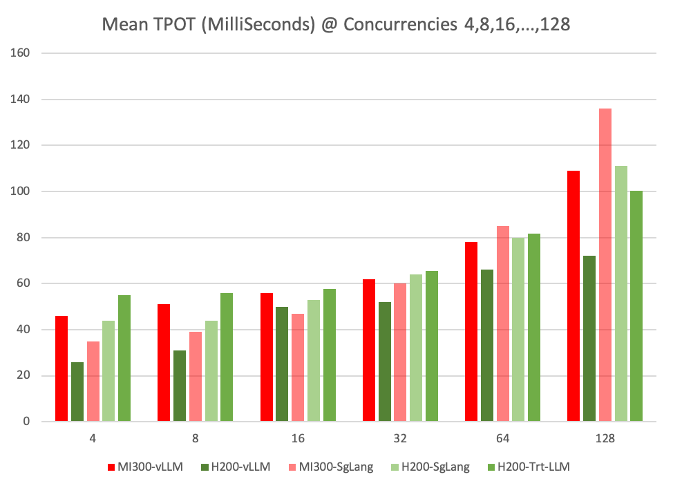
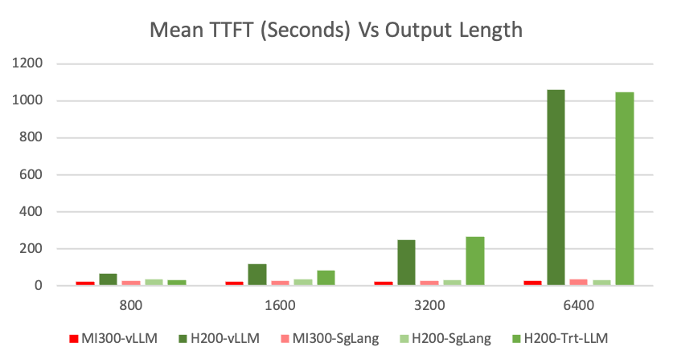
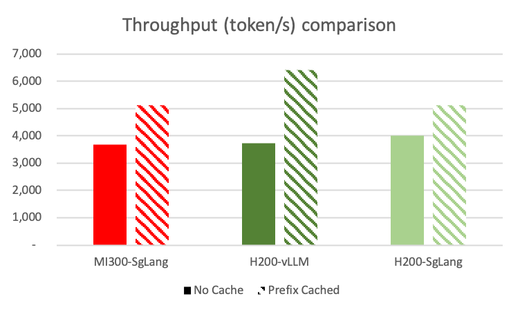
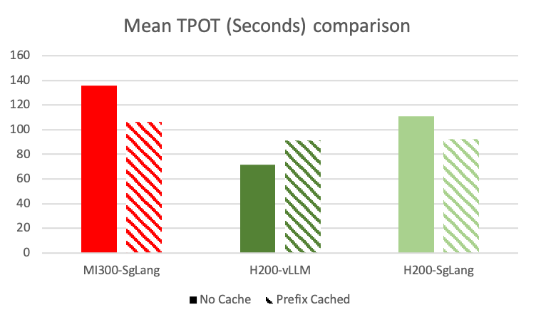

# Evaluate DeepSeek-R1 Inference performance with SgLang, vLLM and TensorRT-LLM on 8xH200 and 8xMi300x

## Introduction
DeepSeek-R1 introduces unique inference challenges due to its innovative architecture—combining Multi-head Latent Attention (MLA) with DeepSeekMoE—and its focus on reasoning tasks. As a reasoning model, it generates additional intermediate chain-of-thought outputs, which puts more pressure on both memory capacity and bandwidth.

In this study, we aim to assess how inference backends—SgLang, vLLM, and TensorRT-LLM—perform when serving DeepSeek-R1 on two hardware configurations: 8×H200 and 8×Mi300x. Our goal is to compare throughput and latency, and determine which backend and hardware pairing best handles the model’s demanding architectural and reasoning requirements.

## Environment
### AMD 8xMi300x
<details>
 <summary>Click to see 8xMi300x detail</summary>
    2x INTEL(R) XEON(R) PLATINUM 8468, 48C/96T, 16GT/s, 105M Cache, 350W
    8x AMD Mi300x GPU, 192GB, 750W
    2015GB DDR5, 4800MT/s 
</details>

### NVIDIA 8xH200 SXM5
<details>
 <summary>Click to see 8xH200 detail</summary>
    2x INTEL(R) XEON(R) PLATINUM 8570, 56C/112T, 20GT/s, 300M Cache, 350W
    8x NVIDIA H200 SXM5 GPU, 141GB, 700W
    2268GB DDR5, 5600MT/s 
</details>

### SgLang-H200
<details>
<summary>Click to see SgLang-H200 details</summary>
    sglang: 0.4.3.post2
    Python: 3.10.12
    NVCC: Cuda compilation tools, release 12.4, V12.4.131
    CUDA Driver Version: 550.144.03
    PyTorch: 2.5.1+cu124'
    sgl_kernel: 0.0.3.post6
    flashinfer: 0.2.1.post2+cu124torch2.5
    triton: 3.1.0
    transformers: 4.48.3
    torchao: 0.8.0
    numpy: 1.26.4
    aiohttp: 3.11.12
    fastapi: 0.115.8
    hf_transfer: 0.1.9
    huggingface_hub: 0.28.1
    interegular: 0.3.3
    modelscope: 1.23.0
    orjson: 3.10.15
    packaging: 24.2
    psutil: 7.0.0
    pydantic: 2.10.6
    multipart: 0.0.20
    zmq: 26.2.1
    uvicorn: 0.34.0
    uvloop: 0.21.0
    vllm: 0.7.2
    openai: 1.63.2
    tiktoken: 0.9.0
    anthropic: 0.45.2
    decord: 0.6.0
</details>

### SgLang-Mi300x
<details>
 <summary>Click to see SgLang-Mi300x details</summary>
    sglang: 0.4.2.post4
    Python: 3.12.8
    HIPCC: HIP version: 6.3.42131-fa1d09cbd
    ROCM Driver Version: 6.8.5
    PyTorch: 2.6.0a0+git8d4926e
    flashinfer: Module Not Found
    triton: 3.2.0
    transformers: 4.48.0
    torchao: 0.8.0
    numpy: 1.26.4
    aiohttp: 3.11.11
    fastapi: 0.115.6
    hf_transfer: 0.1.9
    huggingface_hub: 0.27.1
    interegular: 0.3.3
    modelscope: 1.22.3
    orjson: 3.10.15
    packaging: 24.2
    psutil: 6.1.1
    pydantic: 2.10.5
    multipart: 0.0.20
    zmq: 26.2.0
    uvicorn: 0.34.0
    uvloop: 0.21.0
    vllm: 0.6.7.dev2+g113274a0
    openai: 1.61.1
    anthropic: 0.45.2
    decord: 0.6.0
</details>

### Tensort-LLM-H200
<details>
<summary>Click to see Tensorrt-LLM details</summary>
    Tenssorrt-LLM Version: 0.17.post1.dev
    tensorrt: 10.7.0
    torch:2.6.0a0
    CUDA: 12.6
    CUDA Driver Version:560.35.05
    NCCL: 2.23.4
    Transformers: 4.45.1
</details>

### vLLM-H200
<details>
<summary>Click to see vLLM-H200 details</summary>
    vLLM Version: 0.7.4.dev181+gf35f8e22
    Python version: 3.12.9
    CUDA runtime version: 12.1.105
    Nvidia driver version: 550.144.03
    flashinfer-python==0.2.1.post1+cu124torch2.5
    numpy==1.26.4
    nvidia-cublas-cu12==12.4.5.8
    nvidia-cuda-cupti-cu12==12.4.127
    nvidia-cuda-nvrtc-cu12==12.4.127
    nvidia-cuda-runtime-cu12==12.4.127
    nvidia-cudnn-cu12==9.1.0.70
    nvidia-cufft-cu12==11.2.1.3
    nvidia-curand-cu12==10.3.5.147
    nvidia-cusolver-cu12==11.6.1.9
    nvidia-cusparse-cu12==12.3.1.170
    nvidia-nccl-cu12==2.21.5
    nvidia-nvjitlink-cu12==12.4.127
    nvidia-nvtx-cu12==12.4.127
    pyzmq==26.2.1
    torch==2.5.1
    torchaudio==2.5.1
    torchvision==0.20.1
    transformers==4.49.0
    triton==3.1.0
</details>

### vLLM-Mi300
<details>
<summary>Click to see vLLM-Mi300 details</summary>
    vLLM Version: 0.7.3.dev138+g21f6ca217
    Python version: 3.12.8
    ROCM used to build PyTorch: 6.3.42133-1b9c17779
    PyTorch version: 2.7.0a0+git3a58512
    HIP runtime version: 6.3.42133
    MIOpen runtime version: 3.3.0
    numpy==1.26.4
    pyzmq==26.2.1
    torch==2.7.0a0+git3a58512
    torchvision==0.19.1a0+6194369
    transformers==4.48.2
    triton==3.0.0
</details>

## dstack Task
### SgLang-H200
```yaml
# Below task is to run Sglang inference backend with openai compatible endpoint for online benchmark. 
type: task
name: sg-h200
image: lmsysorg/sglang:latest

commands:
  - python3 -m sglang.launch_server --model deepseek-ai/DeepSeek-R1 --tp 8 --trust-remote-code --enable-dp-attention

resources:
  gpu: 8:H200
  shm_size: 32GB
```
### SgLang-Mi300x
```yaml
# Below task is to run Sglang inference backend with openai compatible endpoint for online benchmark. 
type: task
name: mi300-sglang
image: rocm/sglang-staging:20250212

env:
- MODEL_ID=deepseek-ai/DeepSeek-R1
- HSA_NO_SCRATCH_RECLAIM=1

commands:
  - python3 -m sglang.launch_server --model-path $MODEL_ID --tp 8 --trust-remote-code

resources:
  gpu: 8:MI300X
```

### Tensorrt-LLM-H200
```yaml
# Below task is to run TensorRT-LLM inference backend with openai compatible endpoint for online benchmark. 
type: task
name: trt-h200
image: # Use Docker image built using https://github.com/NVIDIA/TensorRT-LLM.git with commit 9b931c0f6305aefa3660e6fb84a76a42c0eef167

env:
  - MAX_BATCH_SIZE=512
  - MAX_NUM_TOKENS=16384
  - MAX_SEQ_LENGTH=16384
  
commands:
  - git lfs install # Required to pull large repos
  - git clone https://huggingface.co/deepseek-ai/DeepSeek-R1 deepseek
  - trtllm-serve
          --backend pytorch
          --max_batch_size $MAX_BATCH_SIZE
          --max_num_tokens $MAX_NUM_TOKENS
          --max_seq_len $MAX_SEQ_LENGTH
          --tp_size $DSTACK_GPUS_NUM
          --ep_size 4
          --pp_size 1
          deepseek
```
```yaml
# Below task is used to build Deepseek-R1 model engine with TensorRT-LLM deepseek branch. 
# The model engine is used to run TensorRT-LLM offline benchmark.
type: task
name: build-deepseek-r1-engine
image: # Use Docker image built using https://github.com/NVIDIA/TensorRT-LLM.git deepseek branch.

env:
  - MODEL_REPO=https://huggingface.co/deepseek-ai/DeepSeek-R1
  - MAX_SEQ_LEN=128000
  - MAX_INPUT_LEN=64000
  - MAX_NUM_TOKENS=16384
  - MAX_BATCH_SIZE=2048
  - MODEL_DOWNLOAD_DIR=/root/.cache/DeepSeek-R1
  - ENGINE_DIR=/Deepseek-R1-Engine
  - TOKENIZER_DIR=/root/.cache/DeepSeek-R1
  - MODEL_FOLDER=/triton_model_repo
  - CHECK_POINT_DIR=/workflow/TensorRT-LLM/examples/deepseek_v3/deepseek-ckpt
  - TRITON_MAX_BATCH_SIZE=1
  - INSTANCE_COUNT=1
  - MAX_QUEUE_DELAY_MS=0
  - MAX_QUEUE_SIZE=0
  - FILL_TEMPLATE_SCRIPT=/tensorrtllm_backend/tools/fill_template.py
  - DECOUPLED_MODE=true # true for streaming

commands:
  - git clone --branch deepseek --single-branch https://github.com/NVIDIA/TensorRT-LLM.git
  - git clone "$MODEL_REPO" "$MODEL_DOWNLOAD_DIR"
  - cd TensorRT-LLM/examples/deepseek_v3
  - python3 convert_checkpoint.py 
            --model_dir $TOKENIZER_DIR  
            --output_dir $CHECK_POINT_DIR 
            --dtype bfloat16 
            --tp_size $DSTACK_GPUS_NUM
  - trtllm-build 
            --checkpoint_dir $CHECK_POINT_DIR 
            --gemm_plugin bfloat16 
            --output_dir $ENGINE_DIR 
            --max_seq_len $MAX_SEQ_LEN 
            --max_input_len $MAX_INPUT_LEN 
            --max_batch_size $MAX_BATCH_SIZE 
            --gpt_attention_plugin bfloat16 
            --use_paged_context_fmha enable

resources:
  gpu: 8:H200
  shm_size: 32GB
```

### vLLM-H200
```yaml
# Below task is to run vLLM inference backend with openai compatible endpoint for online benchmark. 
type: task
name: vllm-h200
image: vllm/vllm-openai:v0.7.3

env:
- VLLM_ATTENTION_BACKEND=FLASHMLA

commands:
  - pip uninstall -y vllm
  - pip install vllm --pre --extra-index-url https://wheels.vllm.ai/nightly
  - vllm serve deepseek-ai/DeepSeek-R1 --trust-remote-code --tensor-parallel-size 8
  # For Prefix caching
  # - vllm serve deepseek-ai/DeepSeek-R1 --enable-prefix-caching --trust-remote-code --tensor-parallel-size 8 --enable-chunked-prefill

resources:
  gpu: 8:H200
  shm_size: 32GB
```
### vLLM-Mi300
```yaml
# Below task is to run vLLM inference backend with openai compatible endpoint for online benchmark. 
type: task
name: vllm-mi300
image: rocm/vllm-dev:vllm-ds3-staging-0217

env:
- VLLM_FP8_PADDING=0
- VLLM_USE_TRITON_FLASH_ATTN=0

commands:
  - vllm serve deepseek-ai/DeepSeek-R1 --tensor-parallel-size 8 --trust-remote-code --max-model-len 32768

resources:
  gpu: 8:MI300X
```

## Online Benchmarking Commands
For Online Benchmarking we have used Sglang's bench_serving.py script with slight modification to include TensorRT-LLM. The script can be found in [Deepseek-R1/bench_serving.py](https://github.com/dstackai/benchmarks/tree/main/Deepseek-R1/bench_serving.py).
### SgLang
```shell
# No Cache
python3 bench_serving.py --backend sglang \
      --dataset-name random \
      --num-prompts 500 \
      --random-input 3200 \ 
      --random-output 800 \
      --random-range-ratio 1 \
      --max-concurrency 128 # @ Concurrencies 4,8,16,...,128 and @ --random-output 800,1600,3200

# Prefix Cached
python3 bench_serving.py --backend sglang \
    --dataset-name generated-shared-prefix \
    --gsp-num-groups 10 \
    --gsp-prompts-per-group 50 \
    --gsp-system-prompt-len 2000 \
    --gsp-question-len 1200 \
    --gsp-output-len 800 \
    --num-prompts 500 \
    --max-concurrency 128
```
### vLLM
```shell
# No Cache
python3 bench_serving.py --backend vllm \ 
      --dataset-name random \
      --num-prompts 500 \
      --random-input 3200 \ 
      --random-output 800 \
      --random-range-ratio 1 \ 
      --max-concurrency 128 # @ Concurrencies 4,8,16,...,128 and @ --random-output 800,1600,3200

# Prefix Cached
python3 bench_serving.py --backend vllm \
    --dataset-name generated-shared-prefix \
    --gsp-num-groups 10 \
    --gsp-prompts-per-group 50 \
    --gsp-system-prompt-len 2000 \
    --gsp-question-len 1200 \
    --gsp-output-len 800 \
    --num-prompts 500 \
    --max-concurrency 128
```
### TensorRT-LLM
```shell
python3 bench_serving.py --backend trt-torch-flow \
    --dataset-name random \
    --num-prompts 500 \
    --random-input 3200 \ 
    --random-output 800 \
    --random-range-ratio 1 \ 
    --max-concurrency 128 # @ Concurrencies 4,8,16,...,128 and @ --random-output 800,1600,3200
```

## Offline Benchmarking Commands
For vLLM and Sglang Offline Benchmarking, we have used vLLM's benchmark_throughput.py with modifications to include SgLang. For Tensorrt-LLM we have built a custom benchmark_throughput_trt.py based on vLLM's benchmark_throughput.py. The scripts can be found in [Deepseek-R1](https://github.com/dstackai/benchmarks/tree/main/Deepseek-R1).

### Sglang
```shell
python benchmark_throughput.py \
    --backend sglang \
    --model deepseek-ai/DeepSeek-R1 \
    --input-len=3200 \
    --output-len=800 \
    --tensor-parallel-size=8 \
    --max-model-len=32768 \
    --num-prompts=1024 # @ --num-prompts 32,64,128,...,1024 and @ --random-output 800,1600,3200,6400
```
### vLLM
```shell
python benchmark_throughput.py \
    --backend vllm \
    --model deepseek-ai/DeepSeek-R1 \
    --input-len=3200 \
    --output-len=800 \
    --tensor-parallel-size=8 \
    --max-model-len=32768 \
    --num-prompts=1024 # @ --num-prompts 32,64,128,...,1024 and @ --random-output 800,1600,3200,6400
```
### TensorRT-LLM
```shell
python benchmark_throughput_trt.py \
  --model "/path/to/deepseek-engine" \ # Build deepseek-engine using dstack task build-deepseek-r1-engine
  --tokenizer "/root/.cache/DeepSeek-R1" \
  --input-len=3200 \
  --output-len=800 \
  --tensor-parallel-size=8 \
  --max-model-len=32768 \
  --num-prompts=1024 # @ --num-prompts 32,64,128,...,1024 and @ --random-output 800,1600,3200,6400
```

## Benchmark Modes
### Online Inference
For online inference we have used SGLang's [Deepseek-R1/bench_serving.py](https://github.com/dstackai/benchmarks/tree/main/Deepseek-R1/bench_serving.py) script with slight modification to include TensorRT-LLM. We have benchmarked with varying request concurrencies and output token lengths with input token length constant at 3200 as listed in below table.

| Request Concurrencies | Output Token Lengths | Prefix-Cached |
|-----------------------|----------------------|---------------|
| 4,8,16,...,128        | 800                  |No             |
| 128                   | 1600, 3200, 6400     |No             |
| 128                   | 800                  |Yes            |

### Offline Inference
For vLLM and SGLang, we have used vLLM's [Deepseek-R1/benchmark_throughput.py](https://github.com/dstackai/benchmarks/tree/main/Deepseek-R1/benchmark_throughput.py) with modifications to include SGLang. For TensorRT-LLM we have built a custom [Deepseek-R1/benchmark_throughput_trt.py](https://github.com/dstackai/benchmarks/tree/main/Deepseek-R1/benchmark_throughput_trt.py). We have benchmarked with varying batch size and output token lengths with input token length constant at 3200 as listed in below table.

| Batch Sizes           | Output Token Lengths |
|-----------------------|----------------------|
| 32,64,128,...,1024    | 800                  |
| 256,512,1024          | 1600                 |
| 256,512,1024          | 3200                 |

# Key Findings
## Throughput Vs Latency
#### Online Throughput


Mi300 achieves the highest total throughput (input+output), while H200 performs better at lower concurrency levels. vLLM outperforms SgLang and Tensorrt-LLM across a wider range of concurrency levels on both Mi300 and H200, while also achieving the highest throughput.As shown in the online throughput charts, except Mi300-vLLM other configurations begin to plateau once concurrency reaches 64.

- Mi300-vLLM delivers best throughput at higher concurrency levels, particularly at 128. 

- H200-vLLM delivers best throughput performance at lower concurrency levels, especially below 64.

- Mi300-SgLang outperforms both H200-SgLang and Mi300-vLLM at concurrency levels below 32 but remains behind H200-vLLM.

- H200-SgLang surpasses both H200-vLLM and Mi300-SgLang at higher concurrency levels, particularly at 128, but still falls short of Mi300-vLLM.
- H200-Tensorrt-LLM lags behind other configurations at concurrency levels below 16, but starts to outperform both Mi300-Sglang and H200-Sglang at concurrency level above 64. 


<!--  -->

#### Offline Throughput


Unlike online throughput results, H200 achieves the highest overall throughput, while Mi300 performs better at smaller batch sizes. vLLM clearly outperforms SgLang on Mi300, whereas SgLang surpasses vLLM on H200 at medium and larger batch sizes.

- H200-SgLang achieves the highest throughput at larger batch sizes, particularly above 512.

- Mi300-vLLM delivers the best throughput at medium batch sizes, especially between 128 and 256.

- H200-vLLM performs best at smaller batch sizes, particularly below 64.

- Mi300-SgLang lags behind all other configurations except H200-TensorRT-LLM.

- H200-TensorRT-LLM significantly lags behind all other configurations.


*Note: H200-Trt-LLM has been removed from the above Offline Throughput-Latency chart to avoid scale distortion, 
which would compress other configurations and make comparisons difficult.*

<!--  -->

## TTFT & TPOT

#### TTFT Vs Concurrency
H200 achieves the best TTFT at concurrency levels below 64, while Mi300 outperforms once concurrency exceeds 64. vLLM consistently delivers better TTFT than SgLang on both H200 and Mi300, except at concurrency 128. Tensort-LLM beats vLLM and SgLang at concurrency levels below 64.

- H200-Tensorrt-LLM delivers best and consistent TTFT at concurrency levels below 64. Its TTFT degrades significantly at concurrency 128. 

- H200-vLLM delivers second best TTFT at concurrency levels below 16, however at concurrency 128, performance significantly degrades with a sharp spike.

- Mi300-vLLM delivers the best performance beyond concurrency 64.

- H200-Sglang lags behind all other configurations. 


#### TPOT Vs Concurrency
H200-vLLM provides best TPOT performance across all concurrency levels, with a slight exception at concurrency level 16, where Mi300-Sglang provides slightly better performance.

Mi300-SgLang provides second best performance upto concurrency level 32, but performs worst among the configurations beyond this level. 


## Output Token Length
Reasoning models like DeepSeek-R1 generate chains of thought—a series of intermediate reasoning outputs—making it essential to benchmark throughput and latency performance across increasing output token lengths. The pricing of LLM inference also reflects the importance of output token generation: output tokens are typically priced 4x higher than input tokens because they are generated sequentially, whereas input tokens are processed in parallel.

Each time a new output token is generated, the model must fetch and update keys, values, weights, and activations from GPU memory. This process leads to underutilization of GPU compute, as GPUs must remain idle while data is transferred between memory and compute units. Therefore it is intresting to see how inference backends optimize GPU utilization with H200 and Mi300x. 

### Throughput/Latency Vs Output Length
 
#### Online Throughput/Latency Vs Output Length
SgLang on both Mi300 and H200 remains relatively stable as output token length increases, whereas vLLM implementations experience more variation. Notably, H200-vLLM shows a sharp latency spike at 6400 tokens.

SgLang-H200 delivers best throughput as well as end-to-end latency performance with larger output token length, especially after 3200.


*Note: To analyze throughput and latency performance across increasing output token lengths, request concurrency is fixed at 128.*

### Offline Throughput/Latency Vs Output Length
Like Online throughput results, SgLang on both Mi300 and H200 remains relatively stable as output token length increases.

SgLang-H200 delivers best throughput as well as end-to-end latency performance with larger output token lengths, especially after 1600.

We have also examined the throughput and latency performance across increasing output token lengths by scaling batch size to 512 and 1024. As batch size increases, SgLang-H200 achieves higher throughput and lower latency suggesting better GPU utilization.


*Note: To analyze throughput and latency performance across increasing output token lengths, batch size is fixed at 256.*


### TTFT & TPOT Vs Output Length
Time to First Token (TTFT) and Time per Output Token (TPOT) should not vary across increasing output lengths. We have included TTFT/TPOT vs Output Length because we have found some configurations performing inconsistently across increasing output token lengths.
#### TTFT Vs Output Length

- H200-SgLang exhibits consistent TTFT across increasing output token lengths. In fact, TTFT is slightly decreasing as output token length is increasing.
- Mi300-vLLM and Mi300-SgLang exhibits consistent TTFT upto output token length 3200, but slightly degrades at output token length 6400.
- H200-vLLM and H200-Trt-LLM TTFT degrades as output token length increases. At token length 6400, TTFT degrades significantly.



*Note: H200-Tensorrt-LLM & H200-vLLM removed to avoid scale distortion
#### TPOT Vs Output Length

- H200-Sglang and H200-Trt-LLM exhibits consistent TPOT across increasing Output Token Length.
- Mi300-vLLM shows slight degradation of TPOT as Output Token Length reaches 6400.
- H200-vLLM shows significant degradation of TPOT as Output Token Length reaches 6400.


 *Note: To analyze throughput and latency performance across increasing output token lengths, request concurrency is fixed at 128.*

### Prefix Caching
To test prefix caching ability, about 62.5% of each ~3200-token prompt (i.e., 2000 out of 3200 tokens) is a repeated prefix across multiple requests. 

- H200-vLLM outperforms all other configurations in online throughput, TTFT and End to End Latency with Prefix Cached. 

- H200-vLLM's performs TPOT degrades when Prefix Cached, while Sglang performs better in TPOT with both Mi300 and H200 when Prefix Cached.
  






*Note: vLLM's Prefix Caching support for Mi300x is work in progress and can be tracked in [issue](https://github.com/ROCm/vllm/issues/457).*


## Conclusion
### Throughput/End-to-End Latency
- With Mi300x, as seen in [Online Throughput Vs Latency Chart](#online-throughput)  and [Offline Throughput Vs Latency chart](#offline-throughput), vLLM outperforms SgLang on online as well as offline throughput and End-to-End Latency. 
Mi300 with vLLM achieves the overall highest throughput (input + output) of 4574 tokens/s in the online throughput scenario 
. Only at request concurrencies below 32, SgLang outperforms vLLM in online throughput and End-to-End Latency.
  
- With H200, as seen in [Online Throughput Vs Latency Chart](#online-throughput), Tensorrt-LLM outperforms both vLLM and SgLang with highest H200 online throughput of 4176 tokens/s. At concurrencies below 128, vLLM outperforms Sglang and Tensorrt-LLM in online throughput and End-to-End Latency.In the offline throughput scenario, H200 achieves the highest overall throughput of 6311 tokens/s with SgLang, as seen in [Offline Throughput Vs Latency Charts](#offline-throughput)

- With H200, Sglang has potential for optimizating online batch processing to match the efficiency of offline batch processing, whereby delivering highest overall throughput.

- While Mi300x's larger memory capacity and higher bandwidth should enable higher throughput at larger batch sizes in offline inference, given the memory-bound nature of such workloads, the benchmark results show a mixed picture. While online throughput performance aligns with this expectation, the offline results suggest that inference backends for Mi300x may still require further optimization to fully leverage its architectural advantages.

### Throughput/End-to-End Latency Vs Output Token Length
- With H200, as seen in [Online Throughput/Latency Vs Output Length Chart](#online-throughputlatency-vs-output-length) Sglang delivers slightly higher throughput and better latency in online scenario as output token length increases. In Offline scenario with H200, as seen in [Offline Throughput/Latency Vs Output Length Chart](#offline-throughputlatency-vs-output-length) Sglang delivers distinctly higher thoughput and better latency as output token length increases. Sglang with H200 beats Mi300x with both the setups when output token length increases. 

- With Mi300x, as seen in [Online Throughput/Latency Vs Output Length Chart](#online-throughputlatency-vs-output-length) and [Offline Throughput/Latency Vs Output Length Chart](#offline-throughputlatency-vs-output-length) vLLM maintains the lead against SgLang in both online as well as offline scenarios as output token length increases.


### TTFT
- With Mi300x, as seen in [TTFT Vs Concurrency Chart](#ttft-vs-concurrency), vLLM achieves the overall lowest TTFT at concurrency level 128. Below concurrency level 128, vLLM and Sglang have similar TTFT with Mi300x.

- With H200, as seen in [TTFT Vs Concurrency Chart](#ttft-vs-concurrency), TensorRT-LLM maintains the overall lowest and most consistent TTFT up to concurrency 64. 

- TTFT being more compute-intensive, H200’s advantage is evident, aligning with SemiAnalysis’s Mi300x vs. H200 TFLOPS benchmark ([link](https://semianalysis.com/2024/12/22/mi300x-vs-h100-vs-h200-benchmark-part-1-training/)), which shows that despite Mi300x’s higher theoretical TFLOPS, H200 achieves higher TFLOPS in reality. However at 128 concurrent requests, the load shifts to memory capacity and bandwidth, where Mi300x has advantage.

### TPOT
- With H200, as seen in [TPOT Vs Concurrency Chart](#tpot-vs-concurrency), vLLM maintains the overall lowest TPOT at all request concurrencies.

- With Mi300x, as seen in [TPOT Vs Concurrency Chart](#tpot-vs-concurrency), SgLang delivers lowest TPOT upto request concurrency 32. After concurrency 32, vLLM delivers lowest TPOT with Mi300x.

- Given that TPOT is memory-bound, Mi300x should have stronger TPOT advantage with further optimizations.

### TTFT Vs Output Token Length
- With H200, as seen is [TTFT Vs Output Length Chart](#ttft-vs-output-length), Sglang demonstrates stable TTFT across increasing Output Token Length. vLLM and Tensorrt-LLM exhibit a significant increase in Time To First Token (TTFT) as Output Token Length increases. This behavior is likely caused by increasing memory pressure from KV Cache growth as more tokens are generated. Efficient memory management is crucial to maintaining consistent TTFT across different output lengths for H200, as demonstrated by H200 with SgLang.

- With Mi300x, as seen in [TTFT Vs Output Length Chart](#ttft-vs-output-length), vLLM and Sglang both demostrate stable TTFT across increasing Output Token Length. vLLM exhibits lower TTFT compared to Sglang accross all Output Token Lengths.

### TPOT Vs Output Token Length
- With H200, as seen in [TPOT Vs Output Length Chart](#tpot-vs-output-length), Sglang and Tensorrt-LLM demonstrates stable TPOT across increasing Output Token Length. vLLM maintains overall lowest TPOT upto Output Token Length 3200, but suddenly TPOT increases at Token Length 6400. vLLM's abrupt increase is likely caused by increasing memory pressure from KV Cache growth. This requires efficient memory management at higher Output Token Length. 

- With Mi300x, as seen in [TPOT Vs Output Length Chart](#tpot-vs-output-length), both Sglang and vLLM demonstrates stable TPOT across increasing Output Token Length. vLLM maintains lowest TPOT across all Output Token Lengths.

- Given that both TPOT and increasing Output Token Lenghts are memory-bound, Mi300x should have stronger TPOT advantage with further optimizations.

### Prefix Caching
- With H200, as seen in [No Cache Vs Prefix Cached Chart](#prefix-caching) vLLM prefix caching mechanism outperforms SgLang in online throughput, TTFT and End-to-End latency. However vLLM's TPOT increases after prefix is cached. This behavior needs further investigation.

- With Mi300, vLLM does not support prefix caching yet.

### Limitations
1. This benchmark does not evaluate the accuracy of model outputs across different inference backends and GPUs. Including accuracy metrics would help determine if performance improvements come at the cost of model accuracy.
2. The offline benchmark results for TensorRT-LLM were obtained using the DeepSeek-R1 model engine built from the deepseek branch ([link](https://github.com/NVIDIA/TensorRT-LLM/tree/deepseek)). However, the TensorRT-LLM team recommends using the TorchFlow-based approach as outlined [here](https://github.com/NVIDIA/TensorRT-LLM/tree/main/examples/deepseek_v3) instead of deploying model engines directly.As a result, the offline performance of TensorRT-LLM in this benchmark may not reflect its optimal efficiency, since the recommended inference pipeline was not used. 
3. The inference backends evaluated in this benchmark are undergoing continuous optimization, particularly for the DeepSeek-R1 model. Additionally, DeepSeek AI itself is actively releasing performance and efficiency improvements for its models. Due to these ongoing optimizations, the current benchmark results may not accurately represent the long-term performance of these inference setups.
4. The impact of dynamic batching on inference efficiency is not tested. The inference backends adjust batch sizes dynamically based on workload patterns, which can significantly affect real-world performance.

### References
1. [Unlock DeepSeek-R1 Inference Performance on AMD Instinct™ MI300X GPU](https://rocm.blogs.amd.com/artificial-intelligence/DeepSeekR1_Perf/README.html)
2. [Deploy DeepSeek-R1 671B on 8x NVIDIA H200 with SGLang](https://datacrunch.io/blog/deploy-deepseek-r1-on-8x-nvidia-h200)
3. [vLLM Prefix Caching](https://docs.vllm.ai/en/latest/design/automatic_prefix_caching.html#design-automatic-prefix-caching)
4. [SgLang Prefix Caching](https://lmsys.org/blog/2024-01-17-sglang/)
