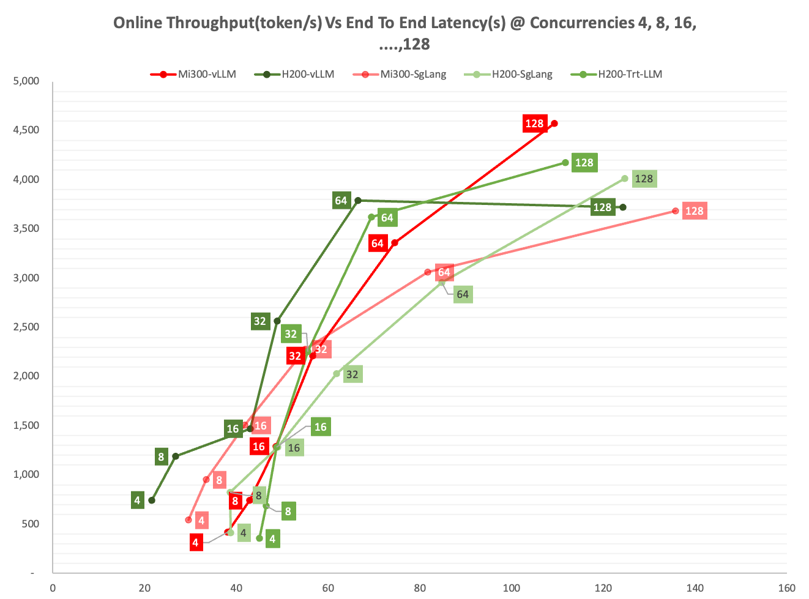
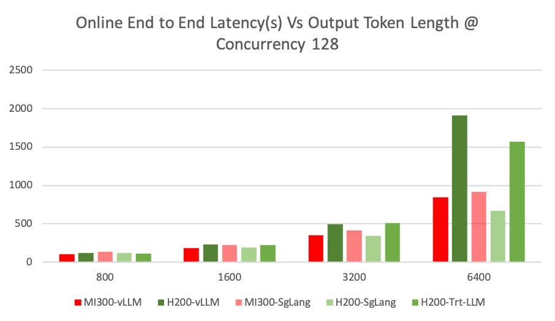
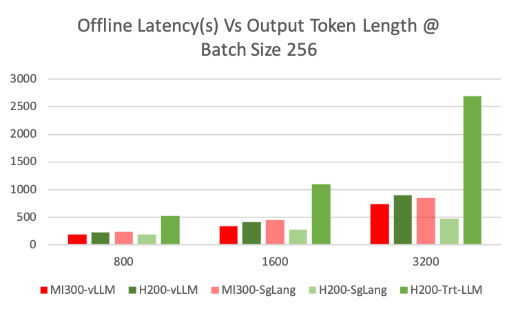
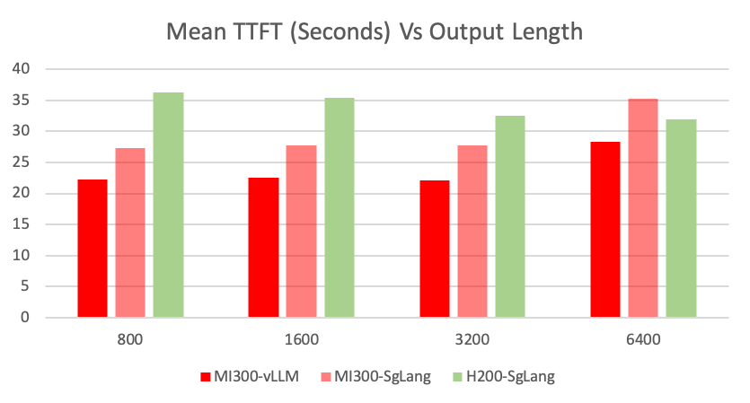
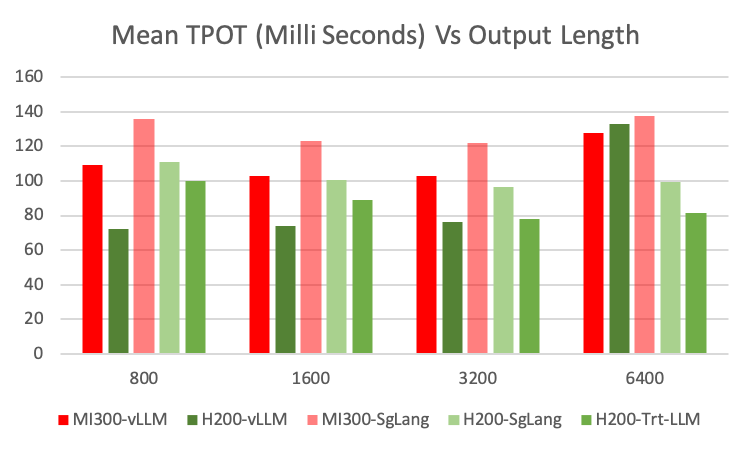

# Evaluate DeepSeek-R1 Inference performance with SgLang, vLLM and TensorRT-LLM on 8xH200 and 8xMi300x

## Introduction
DeepSeek-R1 introduces unique inference challenges due to its innovative architecture—combining Multi-head Latent Attention (MLA) with DeepSeekMoE—and its focus on reasoning tasks. As a reasoning model, it generates additional intermediate chain-of-thought outputs, which puts more pressure on both memory capacity and bandwidth.

In this study, we aim to assess how inference backends—SgLang, vLLM, and TensorRT-LLM—perform when serving DeepSeek-R1 on two hardware configurations: 8×H200 and 8×Mi300x. Our goal is to compare throughput and latency, and determine which backend and hardware pairing best handles the model’s demanding architectural and reasoning requirements.

## Environment
### AMD 8xMi300x
<details>
 <summary>Click to see 8xMi300x detail</summary>
    2x INTEL(R) XEON(R) PLATINUM 8468, 48C/96T, 16GT/s, 105M Cache, 350W
    8x AMD Mi300x GPU, 192GB, 750W
    2015GB DDR5, 4800MT/s 
</details>

### NVIDIA 8xH200 SXM5
<details>
 <summary>Click to see 8xH200 detail</summary>
    2x INTEL(R) XEON(R) PLATINUM 8570, 56C/112T, 20GT/s, 300M Cache, 350W
    8x NVIDIA H200 SXM5 GPU, 141GB, 700W
    2268GB DDR5, 5600MT/s 
</details>

### SgLang-H200
<details>
<summary>Click to see SgLang-H200 details</summary>
    sglang: 0.4.3.post2
    Python: 3.10.12
    NVCC: Cuda compilation tools, release 12.4, V12.4.131
    CUDA Driver Version: 550.144.03
    PyTorch: 2.5.1+cu124'
    sgl_kernel: 0.0.3.post6
    flashinfer: 0.2.1.post2+cu124torch2.5
    triton: 3.1.0
    transformers: 4.48.3
    torchao: 0.8.0
    numpy: 1.26.4
    aiohttp: 3.11.12
    fastapi: 0.115.8
    hf_transfer: 0.1.9
    huggingface_hub: 0.28.1
    interegular: 0.3.3
    modelscope: 1.23.0
    orjson: 3.10.15
    packaging: 24.2
    psutil: 7.0.0
    pydantic: 2.10.6
    multipart: 0.0.20
    zmq: 26.2.1
    uvicorn: 0.34.0
    uvloop: 0.21.0
    vllm: 0.7.2
    openai: 1.63.2
    tiktoken: 0.9.0
    anthropic: 0.45.2
    decord: 0.6.0
</details>

### SgLang-Mi300x
<details>
 <summary>Click to see SgLang-Mi300x details</summary>
    sglang: 0.4.2.post4
    Python: 3.12.8
    HIPCC: HIP version: 6.3.42131-fa1d09cbd
    ROCM Driver Version: 6.8.5
    PyTorch: 2.6.0a0+git8d4926e
    flashinfer: Module Not Found
    triton: 3.2.0
    transformers: 4.48.0
    torchao: 0.8.0
    numpy: 1.26.4
    aiohttp: 3.11.11
    fastapi: 0.115.6
    hf_transfer: 0.1.9
    huggingface_hub: 0.27.1
    interegular: 0.3.3
    modelscope: 1.22.3
    orjson: 3.10.15
    packaging: 24.2
    psutil: 6.1.1
    pydantic: 2.10.5
    multipart: 0.0.20
    zmq: 26.2.0
    uvicorn: 0.34.0
    uvloop: 0.21.0
    vllm: 0.6.7.dev2+g113274a0
    openai: 1.61.1
    anthropic: 0.45.2
    decord: 0.6.0
</details>

### Tensort-LLM-H200
<details>
<summary>Click to see Tensorrt-LLM details</summary>
    Tenssorrt-LLM Version: 0.17.post1.dev
    tensorrt: 10.7.0
    torch:2.6.0a0
    CUDA: 12.6
    CUDA Driver Version:560.35.05
    NCCL: 2.23.4
    Transformers: 4.45.1
</details>

### vLLM-H200
<details>
<summary>Click to see vLLM-H200 details</summary>
    vLLM Version: 0.7.4.dev181+gf35f8e22
    Python version: 3.12.9
    CUDA runtime version: 12.1.105
    Nvidia driver version: 550.144.03
    flashinfer-python==0.2.1.post1+cu124torch2.5
    numpy==1.26.4
    nvidia-cublas-cu12==12.4.5.8
    nvidia-cuda-cupti-cu12==12.4.127
    nvidia-cuda-nvrtc-cu12==12.4.127
    nvidia-cuda-runtime-cu12==12.4.127
    nvidia-cudnn-cu12==9.1.0.70
    nvidia-cufft-cu12==11.2.1.3
    nvidia-curand-cu12==10.3.5.147
    nvidia-cusolver-cu12==11.6.1.9
    nvidia-cusparse-cu12==12.3.1.170
    nvidia-nccl-cu12==2.21.5
    nvidia-nvjitlink-cu12==12.4.127
    nvidia-nvtx-cu12==12.4.127
    pyzmq==26.2.1
    torch==2.5.1
    torchaudio==2.5.1
    torchvision==0.20.1
    transformers==4.49.0
    triton==3.1.0
</details>

### vLLM-Mi300
<details>
<summary>Click to see vLLM-Mi300 details</summary>
    vLLM Version: 0.7.3.dev138+g21f6ca217
    Python version: 3.12.8
    ROCM used to build PyTorch: 6.3.42133-1b9c17779
    PyTorch version: 2.7.0a0+git3a58512
    HIP runtime version: 6.3.42133
    MIOpen runtime version: 3.3.0
    numpy==1.26.4
    pyzmq==26.2.1
    torch==2.7.0a0+git3a58512
    torchvision==0.19.1a0+6194369
    transformers==4.48.2
    triton==3.0.0
</details>

## dstack Task
### SgLang-H200
```yaml
type: task
name: sg-h200
image: lmsysorg/sglang:latest

commands:
  - python3 -m sglang.launch_server --model deepseek-ai/DeepSeek-R1 --tp 8 --trust-remote-code --enable-dp-attention

resources:
  gpu: 8:H200
  shm_size: 32GB
```
### SgLang-Mi300x
```yaml
type: task
name: mi300-sglang
image: rocm/sglang-staging:20250212

env:
- MODEL_ID=deepseek-ai/DeepSeek-R1
- HSA_NO_SCRATCH_RECLAIM=1

commands:
  - python3 -m sglang.launch_server --model-path $MODEL_ID --tp 8 --trust-remote-code

resources:
  gpu: 8:MI300X
```

### Tensorrt-LLM-H200
```yaml
type: task
name: vllm-h200
image: sjbbihan/tensorrt_llm:devel # Docker image using https://github.com/NVIDIA/TensorRT-LLM/tree/deepseek

env:
  - MODEL_REPO=https://huggingface.co/deepseek-ai/DeepSeek-R1
  - MAX_SEQ_LEN=128000
  - MAX_INPUT_LEN=64000
  - MAX_NUM_TOKENS=16384
  - MAX_BATCH_SIZE=2048
  - MODEL_DOWNLOAD_DIR=/root/.cache/DeepSeek-R1
  - ENGINE_DIR=/Deepseek-R1-Engine
  - TOKENIZER_DIR=/root/.cache/DeepSeek-R1
  - MODEL_FOLDER=/triton_model_repo
  - CHECK_POINT_DIR=/workflow/TensorRT-LLM/examples/deepseek_v3/deepseek-ckpt
  - TRITON_MAX_BATCH_SIZE=1
  - INSTANCE_COUNT=1
  - MAX_QUEUE_DELAY_MS=0
  - MAX_QUEUE_SIZE=0
  - FILL_TEMPLATE_SCRIPT=/tensorrtllm_backend/tools/fill_template.py
  - DECOUPLED_MODE=true # true for streaming

commands:
  - git clone --branch deepseek --single-branch https://github.com/NVIDIA/TensorRT-LLM.git
  - git clone "$MODEL_REPO" "$MODEL_DOWNLOAD_DIR"
  - cd TensorRT-LLM/examples/deepseek_v3
  - python3 convert_checkpoint.py 
            --model_dir $TOKENIZER_DIR  
            --output_dir $CHECK_POINT_DIR 
            --dtype bfloat16 
            --tp_size $DSTACK_GPUS_NUM
  - trtllm-build 
            --checkpoint_dir $CHECK_POINT_DIR 
            --gemm_plugin bfloat16 
            --output_dir $ENGINE_DIR 
            --max_seq_len $MAX_SEQ_LEN 
            --max_input_len $MAX_INPUT_LEN 
            --max_batch_size $MAX_BATCH_SIZE 
            --gpt_attention_plugin bfloat16 
            --use_paged_context_fmha enable

resources:
  gpu: 8:H200
  shm_size: 32GB
```

### vLLM-H200
```yaml
type: task
name: vllm-h200
image: vllm/vllm-openai:v0.7.3

env:
- VLLM_ATTENTION_BACKEND=FLASHMLA

commands:
  - pip uninstall -y vllm
  - pip install vllm --pre --extra-index-url https://wheels.vllm.ai/nightly
  - vllm serve deepseek-ai/DeepSeek-R1 --enable-prefix-caching --trust-remote-code --tensor-parallel-size 8 --enable-chunked-prefill

resources:
  gpu: 8:H200
  shm_size: 32GB
```
### vLLM-Mi300
```yaml
type: task
name: vllm-mi300
image: rocm/vllm-dev:vllm-ds3-staging-0217

env:
- VLLM_FP8_PADDING=0
- VLLM_USE_TRITON_FLASH_ATTN=0

commands:
  - vllm serve deepseek-ai/DeepSeek-R1 --tensor-parallel-size 8 --trust-remote-code --max-model-len 32768

resources:
  gpu: 8:MI300X
```

## Key Findings
### Throughput Vs Latency
#### Online Throughput
Mi300 achieves the highest throughput, while H200 performs better at lower concurrency levels. vLLM outperforms SgLang across a wider range of concurrency levels on both Mi300 and H200, while also achieving the highest throughput.
As shown in the online throughput charts except Mi300-vLLM other configurations begin to plateau once concurrency reaches 64.

Mi300-vLLM delivers best throughput at higher concurrency levels, particularly at 128. 

H200-vLLM delivers best throughput performance at lower concurrency levels, especially below 64.

Mi300-SgLang outperforms both H200-SgLang and Mi300-vLLM at concurrency levels below 32 but remains behind H200-vLLM.

H200-SgLang surpasses both H200-vLLM and Mi300-SgLang at higher concurrency levels, particularly at 128, but still falls short of Mi300-vLLM.




#### Offline Throughput
Unlike online throughput results, H200 achieves the highest overall throughput, while Mi300 performs better at smaller batch sizes. 
vLLM clearly outperforms SgLang on Mi300, whereas SgLang surpasses vLLM on H200 at medium and larger batch sizes.

H200-SgLang achieves the highest throughput at larger batch sizes, particularly above 512.

Mi300-vLLM delivers the best throughput at medium batch sizes, especially between 128 and 256.

H200-vLLM performs best at smaller batch sizes, particularly below 64.

Mi300-SgLang lags behind all other configurations except H200-TensorRT-LLM.

H200-TensorRT-LLM significantly lags behind all other configurations.


Note: H200-Trt-LLM has been removed from the above Offline Throughput-Latency chart to avoid scale distortion, 
which would compress other configurations and make comparisons difficult.

### Throughput/Latency Vs Output Length
 
#### Online
To analyze throughput and latency performance across increasing output token lengths, request concurrency is fixed at 128.

SgLang on both Mi300 and H200 remains relatively stable as output token length increases, whereas vLLM implementations experience more variation. Notably, H200-vLLM shows a sharp latency spike at 6400 tokens.

SgLang-H200 delivers best performance with larger output token length, especially after 3200.



### Offline
To analyze throughput and latency performance across increasing output token lengths, batch size is fixed at 256.

Like Online throughput results, SgLang on both Mi300 and H200 remains relatively stable as output token length increases.

SgLang-H200 delivers best performance with larger output token lengths, especially after 1600.




### TTFT & TPOT


#### TTFT & TPOT Vs Output Length






### Prefix Caching


### Conclusion