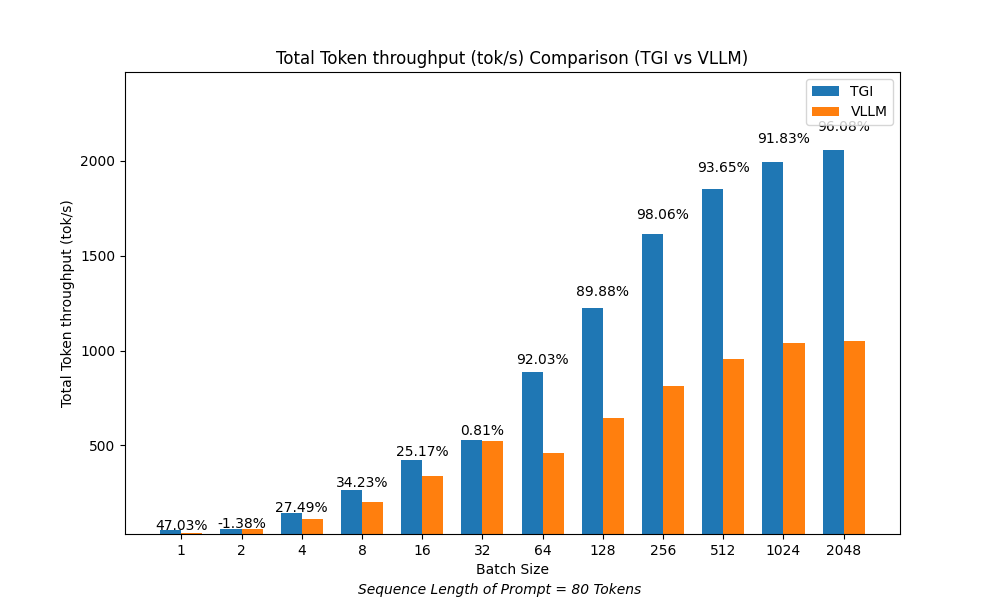
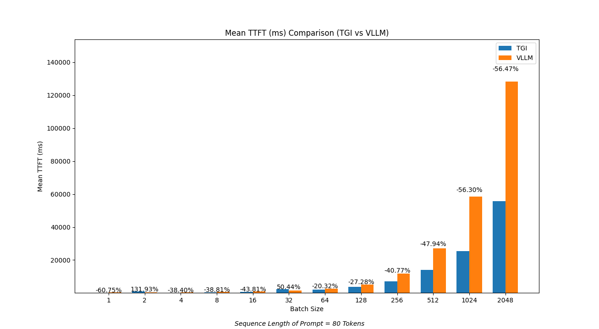
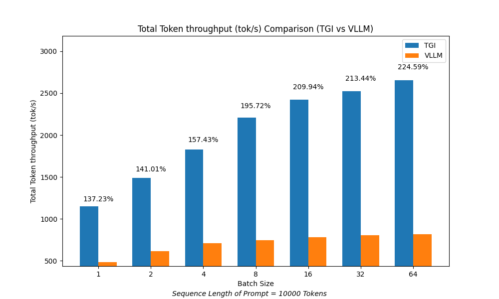
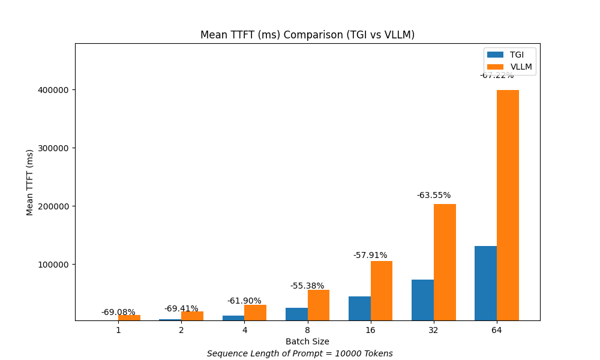
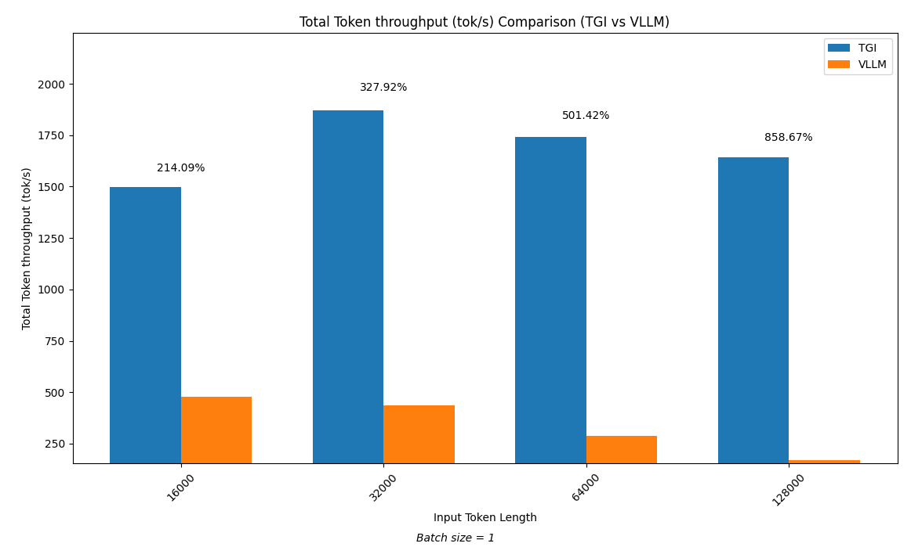
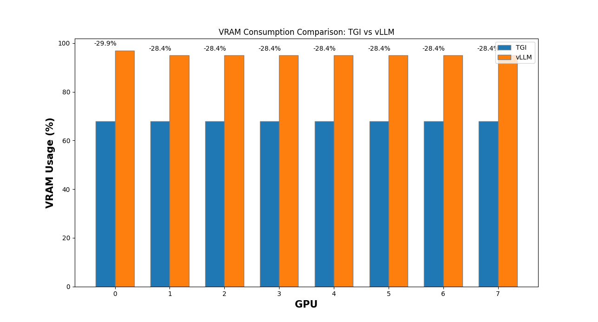

# Benchmarking TGI vs vLLM on AMD 8 X MI300x: Performance Insights with LlaMA 3.1 405B Model

## Introduction
In this benchmarking analysis, we compare the performance of two popular inference backends, `TGI` and `vLLM`, using the `LLaMA 3.1 405B` model on the `8 X AMD MI300x`. 

## Benchmark Setup
### Install dstack
Clone the repo, and run `dstack init`.
```shell
    $ git clone https://github.com/dstackai/dstack
    $ cd dstack
    $ dstack init
```

To run the tests we have modified [benchmark_serving](https://github.com/vllm-project/vllm/blob/main/benchmarks/benchmark_serving.py) script provided by `vLLM`. The script provides instructions on both `TGI` and `vLLM`. The updated code provides open-ai compatible endpoint for TGI.

### vLLM
<details>
  <summary>Click to check our test environment with vLLM</summary>
    
    PyTorch version: 2.4.1+rocm6.1
    Is debug build: False
    CUDA used to build PyTorch: N/A
    ROCM used to build PyTorch: 6.1.40091-a8dbc0c19

    OS: Ubuntu 22.04.4 LTS (x86_64)
    GCC version: (Ubuntu 11.4.0-1ubuntu1~22.04) 11.4.0
    Clang version: 17.0.0 (https://github.com/RadeonOpenCompute/llvm-project roc-6.1.0 24103 7db7f5e49612030319346f900c08f474b1f9023a)
    CMake version: version 3.26.4
    Libc version: glibc-2.35
    
    Python version: 3.10.14 (main, Mar 21 2024, 16:24:04) [GCC 11.2.0] (64-bit runtime)
    Python platform: Linux-6.8.0-45-generic-x86_64-with-glibc2.35
    Is CUDA available: True
    CUDA runtime version: Could not collect
    CUDA_MODULE_LOADING set to: LAZY
    GPU models and configuration: AMD Instinct MI300X (gfx942:sramecc+:xnack-)
    Nvidia driver version: Could not collect
    cuDNN version: Could not collect
    HIP runtime version: 6.1.40093
    MIOpen runtime version: 3.1.0
    Is XNNPACK available: True
    
    Versions of relevant libraries:
    [pip3] mypy==1.4.1
    [pip3] mypy-extensions==1.0.0
    [pip3] numpy==1.26.4
    [pip3] pytorch-triton-rocm==3.0.0
    [pip3] pyzmq==24.0.1
    [pip3] torch==2.4.1+rocm6.1
    [pip3] torchaudio==2.4.1+rocm6.1
    [pip3] torchvision==0.16.1+fdea156
    [pip3] transformers==4.45.1
    [pip3] triton==3.0.0
    [conda] No relevant packages
    ROCM Version: 6.1.40091-a8dbc0c19
    Neuron SDK Version: N/A
    vLLM Version: 0.6.3.dev116+g151ef4ef
    vLLM Build Flags:
    CUDA Archs: Not Set; ROCm: Disabled; Neuron: Disabled
</details>

### Steps
1. Run dstack [task](https://dstack.ai/docs/tasks/). 
```shell
dstack apply -f vllm/benchmark-task.dstack.yml
```
Below is the configuration file that runs vLLM
```yaml
type: task
# This task runs meta-llama/Llama-3.1-405B-Instruct with vLLM

image: ghcr.io/huggingface/text-generation-inference:latest

env:
  - HUGGING_FACE_HUB_TOKEN
  - MODEL_ID=meta-llama/Llama-3.1-405B-Instruct

commands:
  - export PATH=/opt/conda/envs/py_3.10/bin:$PATH
  - wget https://github.com/ROCm/hipBLAS/archive/refs/tags/rocm-6.1.0.zip
  - unzip rocm-6.1.0.zip
  - cd hipBLAS-rocm-6.1.0
  - python rmake.py
  - cd ..
  - git clone https://github.com/vllm-project/vllm.git
  - cd vllm
  - pip install triton
  - pip uninstall torch -y
  - pip install torch torchvision torchaudio --index-url https://download.pytorch.org/whl/rocm6.1
  - pip install /opt/rocm/share/amd_smi
  - pip install --upgrade numba scipy huggingface-hub[cli]
  - pip install "numpy<2"
  - pip install -r requirements-rocm.txt
  - wget -N https://github.com/ROCm/vllm/raw/fa78403/rocm_patch/libamdhip64.so.6 -P /opt/rocm/lib
  - rm -f "$(python3 -c 'import torch; print(torch.__path__[0])')"/lib/libamdhip64.so*
  - export PYTORCH_ROCM_ARCH="gfx90a;gfx942"
  - pip install setuptools_scm
  - python setup.py develop
  - ROCR_VISIBLE_DEVICES=0,1,2,3,4,5,6,7 vllm serve $MODEL_ID --tensor-parallel-size=8 --disable-log-requests --disable-frontend-multiprocessing

ports:
  - 8000
```

2. Run test:
```shell 
$ python scripts/benchmark_serving.py --backend vllm --model meta-llama/Llama-3.1-405B-Instruct 
  --dataset-name sonnet  --num-prompt=<Batch Size> --dataset-path="sonnet.txt" --sonnet-input-len <sequence length>
  # to set different request per second add --request-rate <RPS> in the above command.
```

Note, To create larger prompt sequence lengths, the text in `sonnet.txt` is repeated in the file. Also, default `--sonnet-prefix-len` is set to 50

### TGI
### Steps
1. Run dstack [task](https://dstack.ai/docs/tasks/) to start vLLM server.
```shell
dstack apply -f tgi/benchmark-task.dstack.yml
```
Below is the configuration file that runs TGI
```yaml
type: task
# This task runs meta-llama/Llama-3.1-405B-Instruct with TGI

image: ghcr.io/huggingface/text-generation-inference:sha-11d7af7-rocm

env:
  - HUGGING_FACE_HUB_TOKEN
  - ROCM_USE_FLASH_ATTN_V2_TRITON=true
  - MODEL_ID=meta-llama/Llama-3.1-405B-Instruct
  - TRUST_REMOTE_CODE=true
  - MAX_CONCURRENT_REQUESTS=8192
  - MAX_TOTAL_TOKEN=130000
  - MAX-INPUT-TOKEN

commands:
  - pip install aiohttp
  - pip install datasets
  - text-generation-launcher --port 8000 --num-shard 8 --sharded true --max-concurrent-requests $MAX_CONCURRENT_REQUESTS --max-total-tokens $MAX_TOTAL_TOKEN --max-input-tokens $MAX-INPUT-TOKEN

ports:
  - 8000
```
2. Run test:
```shell 
$ python scripts/benchmark_serving.py --backend vllm --model meta-llama/Llama-3.1-405B-Instruct 
  --dataset-name sonnet  --num-prompt=<Batch Size> --dataset-path="sonnet.txt" --sonnet-input-len <sequence length>
  # to set different request per second add --request-rate <RPS> in the above command.
```
Note, To create larger prompt sequence lengths, the text in `sonnet.txt` is repeated in the file. Also, default `--sonnet-prefix-len` is set to 50


## Results
* TGI outperforms vLLM across all batch sizes in terms of token throughput. The performance gap increases
as the batch size increases. For batches larger than 64, there is significant difference in performance. The sequence
lengths of prompts are kept constant at 80 tokens per prompt.

* TGI outperforms vLLM in `Time To First Token` across all batch sizes except batch size 2 & 32. Here too the performance
gap is significant at larger batches.

* To check the performance in larger prompt sizes we conducted the tests at 10000 tokens per prompt. Here too, 
in terms of token throughput and `TTFT`, `TGI` outperformed `vLLM` significantly.


* Finally, we also performed the tests with single prompt with sequence length starting from 16000 to 128000 tokens(Max allowed by Llama 3.1).
This too yielded results in favor of TGI.

* Another noticeable metric is VRAM consumption with `TGI` and `vLLM`
Below is the `rocm-smi` outputs of TGI & vLLM after they load weights. Notice VRAM consumed is `68%` with TGI while vLLM
consumes `95%`. This might be the reason in significant performance difference.
* VRAM consumption


## What's next?
Check our complete benchmarking post: [Benchmarking Llama 3.1 405B on 8x AMD MI300X GPUs](https://dstack.ai/blog/amd-mi300x-inference-benchmark/). 


