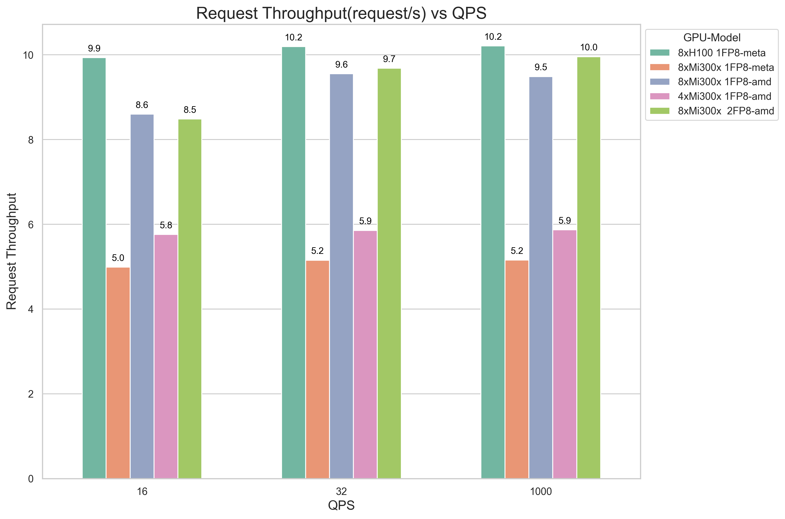
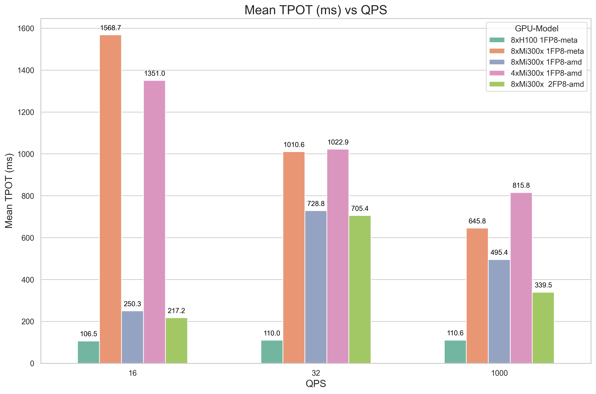
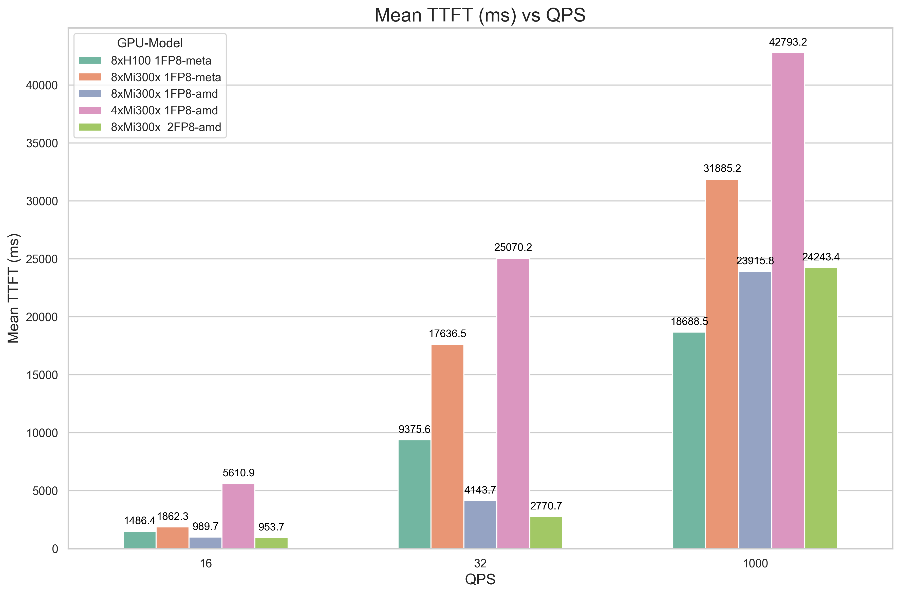
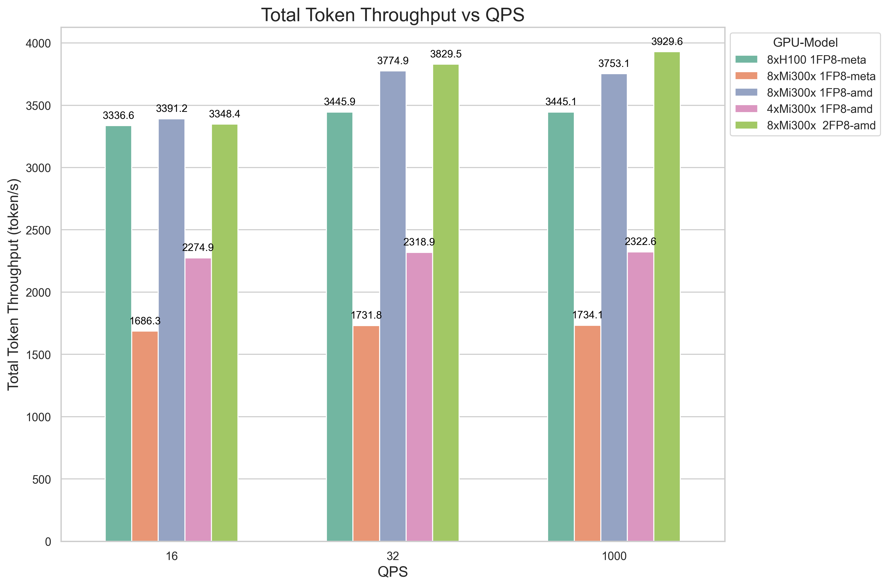
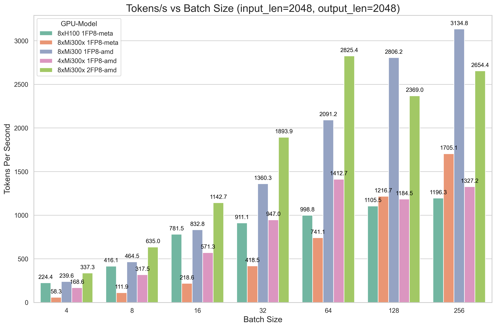
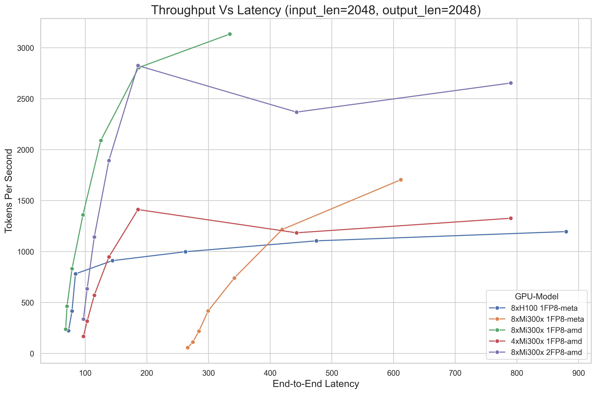
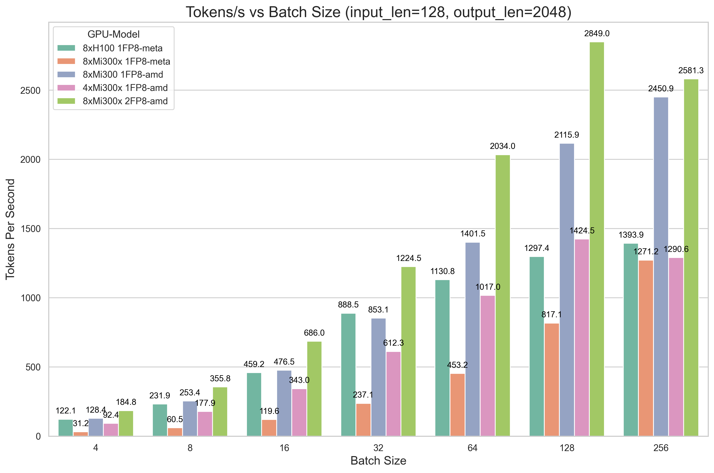
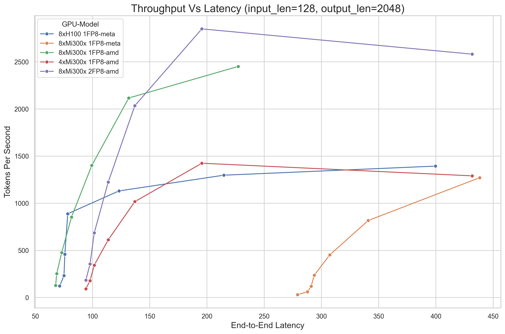
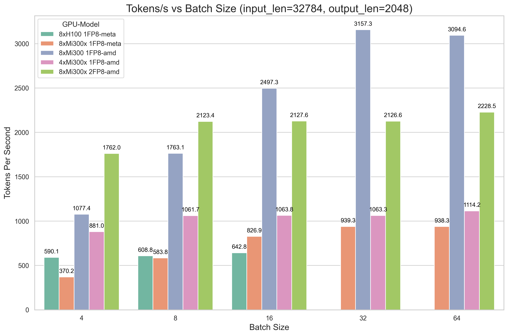
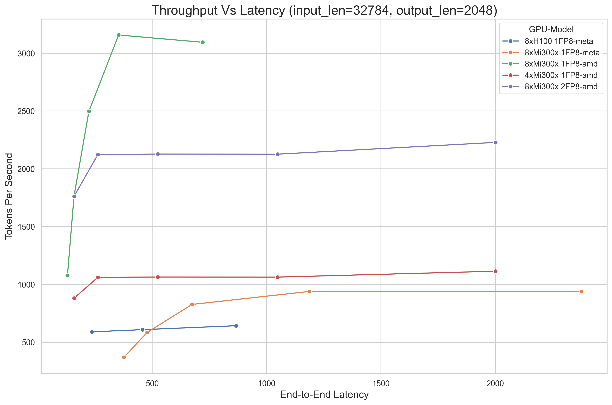

# Llama3.1-405B-Fp8 Inference Performance Comparison between 8xH100SXM5 and 8xMi300x

## Introduction
In this comparison, we test the performance of Nvidia 8xH100 SXM5 and AMD 8xMi300x with Llama3.1-405B-Fp8 using vLLM.

## Environment
### Nvidia 8xH100 SXM5
<details>
<summary>Click to see 8xH100 SXM5 detail</summary>

    PyTorch version: 2.5.1+cu124
    Is debug build: False
    CUDA used to build PyTorch: 12.4
    ROCM used to build PyTorch: N/A

    OS: Ubuntu 22.04.3 LTS (x86_64)
    GCC version: (Ubuntu 11.4.0-1ubuntu1~22.04) 11.4.0
    Clang version: Could not collect
    CMake version: version 3.27.6
    Libc version: glibc-2.35
    
    Python version: 3.10.12 (main, Jun 11 2023, 05:26:28) [GCC 11.4.0] (64-bit runtime)
    Python platform: Linux-6.8.0-47-generic-x86_64-with-glibc2.35
    Is CUDA available: True
    CUDA runtime version: 12.2.140
    CUDA_MODULE_LOADING set to: LAZY
    GPU models and configuration: 
    GPU 0: NVIDIA H100 80GB HBM3
    GPU 1: NVIDIA H100 80GB HBM3
    GPU 2: NVIDIA H100 80GB HBM3
    GPU 3: NVIDIA H100 80GB HBM3
    GPU 4: NVIDIA H100 80GB HBM3
    GPU 5: NVIDIA H100 80GB HBM3
    GPU 6: NVIDIA H100 80GB HBM3
    GPU 7: NVIDIA H100 80GB HBM3

    Nvidia driver version: 550.90.12
    cuDNN version: Probably one of the following:
    /usr/lib/x86_64-linux-gnu/libcudnn.so.8.9.5
    /usr/lib/x86_64-linux-gnu/libcudnn_adv_infer.so.8.9.5
    /usr/lib/x86_64-linux-gnu/libcudnn_adv_train.so.8.9.5
    /usr/lib/x86_64-linux-gnu/libcudnn_cnn_infer.so.8.9.5
    /usr/lib/x86_64-linux-gnu/libcudnn_cnn_train.so.8.9.5
    /usr/lib/x86_64-linux-gnu/libcudnn_ops_infer.so.8.9.5
    /usr/lib/x86_64-linux-gnu/libcudnn_ops_train.so.8.9.5
    HIP runtime version: N/A
    MIOpen runtime version: N/A
    Is XNNPACK available: True
    
    CPU:
    Architecture:                         x86_64
    CPU op-mode(s):                       32-bit, 64-bit
    Address sizes:                        52 bits physical, 57 bits virtual
    Byte Order:                           Little Endian
    CPU(s):                               208
    On-line CPU(s) list:                  0-207
    Vendor ID:                            GenuineIntel
    Model name:                           Intel(R) Xeon(R) Platinum 8480+
    CPU family:                           6
    Model:                                143
    Thread(s) per core:                   2
    Core(s) per socket:                   52
    Socket(s):                            2
    Stepping:                             8
    BogoMIPS:                             4000.00
    Flags:                                fpu vme de pse tsc msr pae mce cx8 apic sep mtrr pge mca cmov pat pse36 clflush mmx fxsr sse sse2 ss ht syscall nx pdpe1gb rdtscp lm constant_tsc arch_perfmon rep_good nopl xtopology cpuid tsc_known_freq pni pclmulqdq vmx ssse3 fma cx16 pdcm pcid sse4_1 sse4_2 x2apic movbe popcnt tsc_deadline_timer aes xsave avx f16c rdrand hypervisor lahf_lm abm 3dnowprefetch cpuid_fault ssbd ibrs ibpb stibp ibrs_enhanced tpr_shadow flexpriority ept vpid ept_ad fsgsbase tsc_adjust bmi1 avx2 smep bmi2 erms invpcid avx512f avx512dq rdseed adx smap avx512ifma clflushopt clwb avx512cd sha_ni avx512bw avx512vl xsaveopt xsavec xgetbv1 xsaves avx_vnni avx512_bf16 wbnoinvd arat vnmi avx512vbmi umip pku ospke waitpkg avx512_vbmi2 gfni vaes vpclmulqdq avx512_vnni avx512_bitalg avx512_vpopcntdq la57 rdpid bus_lock_detect cldemote movdiri movdir64b fsrm md_clear serialize tsxldtrk avx512_fp16 arch_capabilities
    Virtualization:                       VT-x
    Hypervisor vendor:                    KVM
    Virtualization type:                  full
    L1d cache:                            6.5 MiB (208 instances)
    L1i cache:                            6.5 MiB (208 instances)
    L2 cache:                             416 MiB (104 instances)
    L3 cache:                             32 MiB (2 instances)
    NUMA node(s):                         2
    NUMA node0 CPU(s):                    0-103
    NUMA node1 CPU(s):                    104-207
    Vulnerability Gather data sampling:   Not affected
    Vulnerability Itlb multihit:          Not affected
    Vulnerability L1tf:                   Not affected
    Vulnerability Mds:                    Not affected
    Vulnerability Meltdown:               Not affected
    Vulnerability Mmio stale data:        Unknown: No mitigations
    Vulnerability Reg file data sampling: Not affected
    Vulnerability Retbleed:               Not affected
    Vulnerability Spec rstack overflow:   Not affected
    Vulnerability Spec store bypass:      Mitigation; Speculative Store Bypass disabled via prctl
    Vulnerability Spectre v1:             Mitigation; usercopy/swapgs barriers and __user pointer sanitization
    Vulnerability Spectre v2:             Mitigation; Enhanced / Automatic IBRS; IBPB conditional; RSB filling; PBRSB-eIBRS SW sequence; BHI SW loop, KVM SW loop
    Vulnerability Srbds:                  Not affected
    Vulnerability Tsx async abort:        Mitigation; TSX disabled
    
    Versions of relevant libraries:
    [pip3] numpy==1.26.4
    [pip3] nvidia-cublas-cu12==12.4.5.8
    [pip3] nvidia-cuda-cupti-cu12==12.4.127
    [pip3] nvidia-cuda-nvrtc-cu12==12.4.127
    [pip3] nvidia-cuda-runtime-cu12==12.4.127
    [pip3] nvidia-cudnn-cu12==9.1.0.70
    [pip3] nvidia-cufft-cu12==11.2.1.3
    [pip3] nvidia-curand-cu12==10.3.5.147
    [pip3] nvidia-cusolver-cu12==11.6.1.9
    [pip3] nvidia-cusparse-cu12==12.3.1.170
    [pip3] nvidia-dali-cuda120==1.30.0
    [pip3] nvidia-ml-py==12.560.30
    [pip3] nvidia-nccl-cu12==2.21.5
    [pip3] nvidia-nvjitlink-cu12==12.4.127
    [pip3] nvidia-nvtx-cu12==12.4.127
    [pip3] nvidia-pyindex==1.0.9
    [pip3] onnx==1.14.0
    [pip3] pynvml==11.4.1
    [pip3] pytorch-quantization==2.1.2
    [pip3] pyzmq==25.1.1
    [pip3] torch==2.5.1
    [pip3] torch-tensorrt==0.0.0
    [pip3] torchdata==0.7.0a0
    [pip3] torchtext==0.16.0a0
    [pip3] torchvision==0.20.1
    [pip3] transformers==4.46.2
    [pip3] triton==3.1.0
    [conda] Could not collect
    ROCM Version: Could not collect
    Neuron SDK Version: N/A
    vLLM Version: 0.6.3.post2.dev308+gb489fc3c
    vLLM Build Flags:
    CUDA Archs: 5.2 6.0 6.1 7.0 7.2 7.5 8.0 8.6 8.7 9.0+PTX; ROCm: Disabled; Neuron: Disabled
    GPU Topology:
    GPU0	GPU1	GPU2	GPU3	GPU4	GPU5	GPU6	GPU7	NIC0	CPU Affinity	NUMA Affinity	GPU NUMA ID
    GPU0	 X 	NV18	NV18	NV18	NV18	NV18	NV18	NV18	SYS	0-103	0		N/A
    GPU1	NV18	 X 	NV18	NV18	NV18	NV18	NV18	NV18	SYS	0-103	0		N/A
    GPU2	NV18	NV18	 X 	NV18	NV18	NV18	NV18	NV18	SYS	0-103	0		N/A
    GPU3	NV18	NV18	NV18	 X 	NV18	NV18	NV18	NV18	SYS	0-103	0		N/A
    GPU4	NV18	NV18	NV18	NV18	 X 	NV18	NV18	NV18	SYS	104-207	1		N/A
    GPU5	NV18	NV18	NV18	NV18	NV18	 X 	NV18	NV18	SYS	104-207	1		N/A
    GPU6	NV18	NV18	NV18	NV18	NV18	NV18	 X 	NV18	SYS	104-207	1		N/A
    GPU7	NV18	NV18	NV18	NV18	NV18	NV18	NV18	 X 	SYS	104-207	1		N/A
    NIC0	SYS	SYS	SYS	SYS	SYS	SYS	SYS	SYS	 X 				
    
    Legend:
    
      X    = Self
      SYS  = Connection traversing PCIe as well as the SMP interconnect between NUMA nodes (e.g., QPI/UPI)
      NODE = Connection traversing PCIe as well as the interconnect between PCIe Host Bridges within a NUMA node
      PHB  = Connection traversing PCIe as well as a PCIe Host Bridge (typically the CPU)
      PXB  = Connection traversing multiple PCIe bridges (without traversing the PCIe Host Bridge)
      PIX  = Connection traversing at most a single PCIe bridge
      NV#  = Connection traversing a bonded set of # NVLinks
    
    NIC Legend:
    
      NIC0: mlx5_0
    
    NVIDIA_VISIBLE_DEVICES=all
    CUBLAS_VERSION=12.2.5.6
    NVIDIA_REQUIRE_CUDA=cuda>=9.0
    CUDA_CACHE_DISABLE=1
    TORCH_CUDA_ARCH_LIST=5.2 6.0 6.1 7.0 7.2 7.5 8.0 8.6 8.7 9.0+PTX
    NCCL_VERSION=2.19.3
    NVIDIA_DRIVER_CAPABILITIES=compute,utility,video
    NVIDIA_PRODUCT_NAME=PyTorch
    CUDA_VERSION=12.2.2.009
    PYTORCH_VERSION=2.1.0a0+32f93b1
    PYTORCH_BUILD_NUMBER=0
    CUDNN_VERSION=8.9.5.29
    PYTORCH_HOME=/opt/pytorch/pytorch
    LD_LIBRARY_PATH=/usr/local/lib/python3.10/dist-packages/cv2/../../lib64:/usr/local/lib/python3.10/dist-packages/torch/lib:/usr/local/lib/python3.10/dist-packages/torch_tensorrt/lib:/usr/local/cuda/compat/lib:/usr/local/nvidia/lib:/usr/local/nvidia/lib64
    NVIDIA_BUILD_ID=71422337
    CUDA_DRIVER_VERSION=535.104.05
    PYTORCH_BUILD_VERSION=2.1.0a0+32f93b1
    CUDA_HOME=/usr/local/cuda
    CUDA_HOME=/usr/local/cuda
    CUDA_MODULE_LOADING=LAZY
    NVIDIA_REQUIRE_JETPACK_HOST_MOUNTS=
    NVIDIA_PYTORCH_VERSION=23.10
    TORCH_ALLOW_TF32_CUBLAS_OVERRIDE=1
</details>

### AMD 8xMi300x for meta-llama/Llama-3.1-405B-FP8
<details>
<summary>Click to see 8xMi300x detail</summary>
       
       Collecting environment information...
       WARNING 11-18 11:00:24 rocm.py:13] `fork` method is not supported by ROCm. VLLM_WORKER_MULTIPROC_METHOD is overridden to `spawn` instead.
       PyTorch version: 2.6.0.dev20240918+rocm6.2
       Is debug build: False
       CUDA used to build PyTorch: N/A
       ROCM used to build PyTorch: 6.2.41133-dd7f95766

       OS: Ubuntu 20.04.6 LTS (x86_64)
       GCC version: (Ubuntu 9.4.0-1ubuntu1~20.04.2) 9.4.0
       Clang version: 18.0.0git (https://github.com/RadeonOpenCompute/llvm-project roc-6.2.0 24292 26466ce804ac523b398608f17388eb6d605a3f09)
       CMake version: version 3.26.4
       Libc version: glibc-2.31       

       Python version: 3.9.19 (main, May  6 2024, 19:43:03)  [GCC 11.2.0] (64-bit runtime)
       Python platform: Linux-6.8.0-48-generic-x86_64-with-glibc2.31
       Is CUDA available: True
       CUDA runtime version: Could not collect
       CUDA_MODULE_LOADING set to: LAZY
       GPU models and configuration: AMD Instinct MI300X (gfx942:sramecc+:xnack-)
       Nvidia driver version: Could not collect
       cuDNN version: Could not collect
       HIP runtime version: 6.2.41133
       MIOpen runtime version: 3.2.0
       Is XNNPACK available: True       

       CPU:
       Architecture:                         x86_64
       CPU op-mode(s):                       32-bit, 64-bit
       Byte Order:                           Little Endian
       Address sizes:                        46 bits physical, 57 bits virtual
       CPU(s):                               128
       On-line CPU(s) list:                  0-127
       Thread(s) per core:                   2
       Core(s) per socket:                   32
       Socket(s):                            2
       NUMA node(s):                         2
       Vendor ID:                            GenuineIntel
       CPU family:                           6
       Model:                                143
       Model name:                           Intel(R) Xeon(R) Platinum 8462Y+
       Stepping:                             8
       CPU MHz:                              798.376
       CPU max MHz:                          4100.0000
       CPU min MHz:                          800.0000
       BogoMIPS:                             5600.00
       Virtualization:                       VT-x
       L1d cache:                            3 MiB
       L1i cache:                            2 MiB
       L2 cache:                             128 MiB
       L3 cache:                             120 MiB
       NUMA node0 CPU(s):                    0,2,4,6,8,10,12,14,16,18,20,22,24,26,28,30,32,34,36,38,40,42,44,46,48,50,52,54,56,58,60,62,64,66,68,70,72,74,76,78,80,82,84,86,88,90,92,94,96,98,100,102,104,106,108,110,112,114,116,118,120,122,124,126
       NUMA node1 CPU(s):                    1,3,5,7,9,11,13,15,17,19,21,23,25,27,29,31,33,35,37,39,41,43,45,47,49,51,53,55,57,59,61,63,65,67,69,71,73,75,77,79,81,83,85,87,89,91,93,95,97,99,101,103,105,107,109,111,113,115,117,119,121,123,125,127
       Vulnerability Gather data sampling:   Not affected
       Vulnerability Itlb multihit:          Not affected
       Vulnerability L1tf:                   Not affected
       Vulnerability Mds:                    Not affected
       Vulnerability Meltdown:               Not affected
       Vulnerability Mmio stale data:        Not affected
       Vulnerability Reg file data sampling: Not affected
       Vulnerability Retbleed:               Not affected
       Vulnerability Spec rstack overflow:   Not affected
       Vulnerability Spec store bypass:      Mitigation; Speculative Store Bypass disabled via prctl
       Vulnerability Spectre v1:             Mitigation; usercopy/swapgs barriers and __user pointer sanitization
       Vulnerability Spectre v2:             Mitigation; Enhanced / Automatic IBRS; IBPB conditional; RSB filling; PBRSB-eIBRS SW sequence; BHI BHI_DIS_S
       Vulnerability Srbds:                  Not affected
       Vulnerability Tsx async abort:        Not affected
       Flags:                                fpu vme de pse tsc msr pae mce cx8 apic sep mtrr pge mca cmov pat pse36 clflush dts acpi mmx fxsr sse sse2 ss ht tm pbe syscall nx pdpe1gb rdtscp lm constant_tsc art arch_perfmon pebs bts rep_good nopl xtopology nonstop_tsc cpuid aperfmperf tsc_known_freq pni pclmulqdq dtes64 monitor ds_cpl vmx smx est tm2 ssse3 sdbg fma cx16 xtpr pdcm pcid dca sse4_1 sse4_2 x2apic movbe popcnt tsc_deadline_timer aes xsave avx f16c rdrand lahf_lm abm 3dnowprefetch cpuid_fault epb cat_l3 cat_l2 cdp_l3 cdp_l2 ssbd mba ibrs ibpb stibp ibrs_enhanced tpr_shadow flexpriority ept vpid ept_ad fsgsbase tsc_adjust bmi1 avx2 smep bmi2 erms invpcid cqm rdt_a avx512f avx512dq rdseed adx smap avx512ifma clflushopt clwb intel_pt avx512cd sha_ni avx512bw avx512vl xsaveopt xsavec xgetbv1 xsaves cqm_llc cqm_occup_llc cqm_mbm_total cqm_mbm_local split_lock_detect user_shstk avx_vnni avx512_bf16 wbnoinvd dtherm ida arat pln pts hfi vnmi avx512vbmi umip pku ospke waitpkg avx512_vbmi2 gfni vaes vpclmulqdq avx512_vnni avx512_bitalg tme avx512_vpopcntdq la57 rdpid bus_lock_detect cldemote movdiri movdir64b enqcmd fsrm md_clear serialize tsxldtrk pconfig arch_lbr ibt amx_bf16 avx512_fp16 amx_tile amx_int8 flush_l1d arch_capabilities       

       Versions of relevant libraries:
       [pip3] mypy==1.8.0
       [pip3] mypy-extensions==1.0.0
       [pip3] numpy==1.26.4
       [pip3] optree==0.9.1
       [pip3] pytorch-triton-rocm==3.1.0+5fe38ffd73
       [pip3] pyzmq==26.2.0
       [pip3] torch==2.6.0.dev20240918+rocm6.2
       [pip3] torchvision==0.20.0.dev20240918+rocm6.2
       [pip3] transformers==4.45.2
       [pip3] triton==3.0.0
       [conda] No relevant packages
       ROCM Version: 6.2.41133-dd7f95766
       Neuron SDK Version: N/A
       vLLM Version: 0.6.3.dev109+gcb3b2b9b.d20241010
       vLLM Build Flags:
       CUDA Archs: Not Set; ROCm: Disabled; Neuron: Disabled
       GPU Topology:
       ============================ ROCm System Management Interface ============================
       ================================ Weight between two GPUs =================================
              GPU0         GPU1         GPU2         GPU3         GPU4         GPU5         GPU6         GPU7         
       GPU0   0            15           15           15           15           15           15           15           
       GPU1   15           0            15           15           15           15           15           15           
       GPU2   15           15           0            15           15           15           15           15           
       GPU3   15           15           15           0            15           15           15           15           
       GPU4   15           15           15           15           0            15           15           15           
       GPU5   15           15           15           15           15           0            15           15           
       GPU6   15           15           15           15           15           15           0            15           
       GPU7   15           15           15           15           15           15           15           0                   

       ================================= Hops between two GPUs ==================================
              GPU0         GPU1         GPU2         GPU3         GPU4         GPU5         GPU6         GPU7         
       GPU0   0            1            1            1            1            1            1            1            
       GPU1   1            0            1            1            1            1            1            1            
       GPU2   1            1            0            1            1            1            1            1            
       GPU3   1            1            1            0            1            1            1            1            
       GPU4   1            1            1            1            0            1            1            1            
       GPU5   1            1            1            1            1            0            1            1            
       GPU6   1            1            1            1            1            1            0            1            
       GPU7   1            1            1            1            1            1            1            0                   

       =============================== Link Type between two GPUs ===============================
              GPU0         GPU1         GPU2         GPU3         GPU4         GPU5         GPU6         GPU7         
       GPU0   0            XGMI         XGMI         XGMI         XGMI         XGMI         XGMI         XGMI         
       GPU1   XGMI         0            XGMI         XGMI         XGMI         XGMI         XGMI         XGMI         
       GPU2   XGMI         XGMI         0            XGMI         XGMI         XGMI         XGMI         XGMI         
       GPU3   XGMI         XGMI         XGMI         0            XGMI         XGMI         XGMI         XGMI         
       GPU4   XGMI         XGMI         XGMI         XGMI         0            XGMI         XGMI         XGMI         
       GPU5   XGMI         XGMI         XGMI         XGMI         XGMI         0            XGMI         XGMI         
       GPU6   XGMI         XGMI         XGMI         XGMI         XGMI         XGMI         0            XGMI         
       GPU7   XGMI         XGMI         XGMI         XGMI         XGMI         XGMI         XGMI         0                   

       ======================================= Numa Nodes =======================================
       GPU[0]		: (Topology) Numa Node: 0
       GPU[0]		: (Topology) Numa Affinity: 0
       GPU[1]		: (Topology) Numa Node: 0
       GPU[1]		: (Topology) Numa Affinity: 0
       GPU[2]		: (Topology) Numa Node: 0
       GPU[2]		: (Topology) Numa Affinity: 0
       GPU[3]		: (Topology) Numa Node: 0
       GPU[3]		: (Topology) Numa Affinity: 0
       GPU[4]		: (Topology) Numa Node: 1
       GPU[4]		: (Topology) Numa Affinity: 1
       GPU[5]		: (Topology) Numa Node: 1
       GPU[5]		: (Topology) Numa Affinity: 1
       GPU[6]		: (Topology) Numa Node: 1
       GPU[6]		: (Topology) Numa Affinity: 1
       GPU[7]		: (Topology) Numa Node: 1
       GPU[7]		: (Topology) Numa Affinity: 1
       ================================== End of ROCm SMI Log ===================================
</details>

### AMD 8xMi300x for amd/Llama-3.1-405B-Instruct-FP8-KV
<details>
<summary>Click to see 8xMi300x detail</summary>
    
    Collecting environment information...
    PyTorch version: 2.5.0a0+gitcedc116
    Is debug build: False
    CUDA used to build PyTorch: N/A
    ROCM used to build PyTorch: 6.2.41133-dd7f95766
    
    OS: Ubuntu 20.04.6 LTS (x86_64)
    GCC version: (Ubuntu 9.4.0-1ubuntu1~20.04.2) 9.4.0
    Clang version: 18.0.0git (https://github.com/RadeonOpenCompute/llvm-project roc-6.2.0 24292 26466ce804ac523b398608f17388eb6d605a3f09)
    CMake version: version 3.26.4
    Libc version: glibc-2.31
    
    Python version: 3.9.19 (main, May  6 2024, 19:43:03)  [GCC 11.2.0] (64-bit runtime)
    Python platform: Linux-6.8.0-48-generic-x86_64-with-glibc2.31
    Is CUDA available: True
    CUDA runtime version: Could not collect
    CUDA_MODULE_LOADING set to: LAZY
    GPU models and configuration: AMD Instinct MI300X (gfx942:sramecc+:xnack-)
    Nvidia driver version: Could not collect
    cuDNN version: Could not collect
    HIP runtime version: 6.2.41133
    MIOpen runtime version: 3.2.0
    Is XNNPACK available: True
    
    CPU:
    Architecture:                         x86_64
    CPU op-mode(s):                       32-bit, 64-bit
    Byte Order:                           Little Endian
    Address sizes:                        46 bits physical, 57 bits virtual
    CPU(s):                               128
    On-line CPU(s) list:                  0-127
    Thread(s) per core:                   2
    Core(s) per socket:                   32
    Socket(s):                            2
    NUMA node(s):                         2
    Vendor ID:                            GenuineIntel
    CPU family:                           6
    Model:                                143
    Model name:                           Intel(R) Xeon(R) Platinum 8462Y+
    Stepping:                             8
    CPU MHz:                              2545.726
    CPU max MHz:                          4100.0000
    CPU min MHz:                          800.0000
    BogoMIPS:                             5600.00
    Virtualization:                       VT-x
    L1d cache:                            3 MiB
    L1i cache:                            2 MiB
    L2 cache:                             128 MiB
    L3 cache:                             120 MiB
    NUMA node0 CPU(s):                    0,2,4,6,8,10,12,14,16,18,20,22,24,26,28,30,32,34,36,38,40,42,44,46,48,50,52,54,56,58,60,62,64,66,68,70,72,74,76,78,80,82,84,86,88,90,92,94,96,98,100,102,104,106,108,110,112,114,116,118,120,122,124,126
    NUMA node1 CPU(s):                    1,3,5,7,9,11,13,15,17,19,21,23,25,27,29,31,33,35,37,39,41,43,45,47,49,51,53,55,57,59,61,63,65,67,69,71,73,75,77,79,81,83,85,87,89,91,93,95,97,99,101,103,105,107,109,111,113,115,117,119,121,123,125,127
    Vulnerability Gather data sampling:   Not affected
    Vulnerability Itlb multihit:          Not affected
    Vulnerability L1tf:                   Not affected
    Vulnerability Mds:                    Not affected
    Vulnerability Meltdown:               Not affected
    Vulnerability Mmio stale data:        Not affected
    Vulnerability Reg file data sampling: Not affected
    Vulnerability Retbleed:               Not affected
    Vulnerability Spec rstack overflow:   Not affected
    Vulnerability Spec store bypass:      Mitigation; Speculative Store Bypass disabled via prctl
    Vulnerability Spectre v1:             Mitigation; usercopy/swapgs barriers and __user pointer sanitization
    Vulnerability Spectre v2:             Mitigation; Enhanced / Automatic IBRS; IBPB conditional; RSB filling; PBRSB-eIBRS SW sequence; BHI BHI_DIS_S
    Vulnerability Srbds:                  Not affected
    Vulnerability Tsx async abort:        Not affected
    Flags:                                fpu vme de pse tsc msr pae mce cx8 apic sep mtrr pge mca cmov pat pse36 clflush dts acpi mmx fxsr sse sse2 ss ht tm pbe syscall nx pdpe1gb rdtscp lm constant_tsc art arch_perfmon pebs bts rep_good nopl xtopology nonstop_tsc cpuid aperfmperf tsc_known_freq pni pclmulqdq dtes64 monitor ds_cpl vmx smx est tm2 ssse3 sdbg fma cx16 xtpr pdcm pcid dca sse4_1 sse4_2 x2apic movbe popcnt tsc_deadline_timer aes xsave avx f16c rdrand lahf_lm abm 3dnowprefetch cpuid_fault epb cat_l3 cat_l2 cdp_l3 cdp_l2 ssbd mba ibrs ibpb stibp ibrs_enhanced tpr_shadow flexpriority ept vpid ept_ad fsgsbase tsc_adjust bmi1 avx2 smep bmi2 erms invpcid cqm rdt_a avx512f avx512dq rdseed adx smap avx512ifma clflushopt clwb intel_pt avx512cd sha_ni avx512bw avx512vl xsaveopt xsavec xgetbv1 xsaves cqm_llc cqm_occup_llc cqm_mbm_total cqm_mbm_local split_lock_detect user_shstk avx_vnni avx512_bf16 wbnoinvd dtherm ida arat pln pts hfi vnmi avx512vbmi umip pku ospke waitpkg avx512_vbmi2 gfni vaes vpclmulqdq avx512_vnni avx512_bitalg tme avx512_vpopcntdq la57 rdpid bus_lock_detect cldemote movdiri movdir64b enqcmd fsrm md_clear serialize tsxldtrk pconfig arch_lbr ibt amx_bf16 avx512_fp16 amx_tile amx_int8 flush_l1d arch_capabilities
    
    Versions of relevant libraries:
    [pip3] mypy==1.8.0
    [pip3] mypy-extensions==1.0.0
    [pip3] numpy==1.26.4
    [pip3] optree==0.9.1
    [pip3] pyzmq==26.2.0
    [pip3] torch==2.5.0a0+gitcedc116
    [pip3] torchvision==0.19.1a0+6194369
    [pip3] transformers==4.46.0
    [pip3] triton==3.0.0
    [conda] No relevant packages
    ROCM Version: 6.2.41133-dd7f95766
    Neuron SDK Version: N/A
    vLLM Version: 0.6.4.dev4+gc9fc1608
    vLLM Build Flags:
    CUDA Archs: Not Set; ROCm: Disabled; Neuron: Disabled
    GPU Topology:
    ============================ ROCm System Management Interface ============================
    ================================ Weight between two GPUs =================================
           GPU0         GPU1         GPU2         GPU3         GPU4         GPU5         GPU6         GPU7         
    GPU0   0            15           15           15           15           15           15           15           
    GPU1   15           0            15           15           15           15           15           15           
    GPU2   15           15           0            15           15           15           15           15           
    GPU3   15           15           15           0            15           15           15           15           
    GPU4   15           15           15           15           0            15           15           15           
    GPU5   15           15           15           15           15           0            15           15           
    GPU6   15           15           15           15           15           15           0            15           
    GPU7   15           15           15           15           15           15           15           0            
    
    ================================= Hops between two GPUs ==================================
           GPU0         GPU1         GPU2         GPU3         GPU4         GPU5         GPU6         GPU7         
    GPU0   0            1            1            1            1            1            1            1            
    GPU1   1            0            1            1            1            1            1            1            
    GPU2   1            1            0            1            1            1            1            1            
    GPU3   1            1            1            0            1            1            1            1            
    GPU4   1            1            1            1            0            1            1            1            
    GPU5   1            1            1            1            1            0            1            1            
    GPU6   1            1            1            1            1            1            0            1            
    GPU7   1            1            1            1            1            1            1            0            
    
    =============================== Link Type between two GPUs ===============================
           GPU0         GPU1         GPU2         GPU3         GPU4         GPU5         GPU6         GPU7         
    GPU0   0            XGMI         XGMI         XGMI         XGMI         XGMI         XGMI         XGMI         
    GPU1   XGMI         0            XGMI         XGMI         XGMI         XGMI         XGMI         XGMI         
    GPU2   XGMI         XGMI         0            XGMI         XGMI         XGMI         XGMI         XGMI         
    GPU3   XGMI         XGMI         XGMI         0            XGMI         XGMI         XGMI         XGMI         
    GPU4   XGMI         XGMI         XGMI         XGMI         0            XGMI         XGMI         XGMI         
    GPU5   XGMI         XGMI         XGMI         XGMI         XGMI         0            XGMI         XGMI         
    GPU6   XGMI         XGMI         XGMI         XGMI         XGMI         XGMI         0            XGMI         
    GPU7   XGMI         XGMI         XGMI         XGMI         XGMI         XGMI         XGMI         0            
    
    ======================================= Numa Nodes =======================================
    GPU[0]		: (Topology) Numa Node: 0
    GPU[0]		: (Topology) Numa Affinity: 0
    GPU[1]		: (Topology) Numa Node: 0
    GPU[1]		: (Topology) Numa Affinity: 0
    GPU[2]		: (Topology) Numa Node: 0
    GPU[2]		: (Topology) Numa Affinity: 0
    GPU[3]		: (Topology) Numa Node: 0
    GPU[3]		: (Topology) Numa Affinity: 0
    GPU[4]		: (Topology) Numa Node: 1
    GPU[4]		: (Topology) Numa Affinity: 1
    GPU[5]		: (Topology) Numa Node: 1
    GPU[5]		: (Topology) Numa Affinity: 1
    GPU[6]		: (Topology) Numa Node: 1
    GPU[6]		: (Topology) Numa Affinity: 1
    GPU[7]		: (Topology) Numa Node: 1
    GPU[7]		: (Topology) Numa Affinity: 1
    ================================== End of ROCm SMI Log ===================================
    
    PYTORCH_TUNABLEOP_TUNING=0
    PYTORCH_TESTING_DEVICE_ONLY_FOR=cuda
    PYTORCH_TUNABLEOP_ENABLED=0
    PYTORCH_TEST_WITH_ROCM=1
    PYTORCH_ROCM_ARCH=gfx90a;gfx942
    MAX_JOBS=32
    LD_LIBRARY_PATH=/opt/conda/envs/py_3.9/lib/python3.9/site-packages/cv2/../../lib64:/opt/ompi/lib:/opt/rocm/lib:/usr/local/lib::/opt/rocm/lib/:/opt/conda/envs/py_3.9/lib/python3.9/site-packages/torch/lib:
    PYTORCH_TUNABLEOP_FILENAME=/app/tuned_gemm_csv/afo_tune_device_%d_full.csv
    VLLM_WORKER_MULTIPROC_METHOD=spawn
    CUDA_MODULE_LOADING=LAZY

</details>

### Installation/serving with AMD 8xMi300x
```shell
$ sh -c 'echo 0 > /proc/sys/kernel/numa_balancing'
$ docker run -it \
   --network=host \
   --group-add=video \
   --ipc=host \
   --cap-add=SYS_PTRACE \
   --security-opt seccomp=unconfined \
   --device /dev/kfd \
   --device /dev/dri \
   -v /mnt/nvme5n1p1/cache:/root/.cache \
   ghcr.io/embeddedllm/vllm-rocm:cb3b2b9 \
   bash
$ VLLM_RPC_TIMEOUT=30000 VLLM_USE_TRITON_FLASH_ATTN=0 vllm serve meta-llama/Llama-3.1-405B-FP8 --host 0.0.0.0 --port 8000 -tp 8 --max-seq-len-to-capture 16384 --served-model-name meta-llama/Llama-3.1-405B-FP8 --enable-chunked-prefill=False --num-scheduler-step 15 --max-num-seqs 1024 
```

### Installation/serving with Nvidia 8xH100 SXM5
```shell
$ docker run --gpus all -it --rm --ipc=host -v /home/ubuntu/.cache:/root/.cache nvcr.io/nvidia/pytorch:23.10-py3
$ pip install https://vllm-wheels.s3.us-west-2.amazonaws.com/nightly/vllm-1.0.0.dev-cp38-abi3-manylinux1_x86_64.whl
$ vllm serve meta-llama/Llama-3.1-405B-FP8 --tensor-parallel-size 8 --max-model-len 91680
```
## Online Serving Benchmark Results
To execute serving benchmark, we utilized the script [benchmark_serving.py](https://github.com/vllm-project/vllm/blob/main/benchmarks/benchmark_serving.py)

We conducted the benchmark across QPS 16,32 and 1000, to assess performance under different load conditions.

Below is the command to run the script in both hardware.
```shell
python3 benchmark_serving.py --backend vllm --model meta-llama/Llama-3.1-405B-FP8 --dataset-name sharegpt --dataset-path="ShareGPT_V3_unfiltered_cleaned_split.json" --request-rate=QPS
```
## Key Findings ([Check Raw Data](h100sxm5_vs_mi300x/raw_data/))

- <span style="color: #8eca9c;">H100</span> refers to 8xH100 SXM5 running meta-llama/Llama-3.1-405B-Instruct-FP8
- <span style="color: #f4b183;">Mi300x-meta-model</span> refers to 8xMi300x running meta-llama/Llama-3.1-405B-Instruct-FP8
- <span style="color: #9fc5e8;">Mi300x-amd-model</span> refers to 8xMi300x running amd/Llama-3.1-405B-Instruct-FP8-KV

1. `H100` beats both `Mi300x-meta-model` and `Mi300x-amd-model`  in `throughput(request/s)` and `mean TPOT(ms)` across QPS levels 16, 32 and 1000.



2. `Mi300x-amd-model` beats `H100` in `mean TTFT` at QPS level 16 and 32. However, `H100` beats
`Mi300x-meta-model` in `mean TTFT` at QPS level 1000.`Mi300x-meta-model` performs the worst across all specified QPS levels .Also, without
setting `VLLM_RPC_TIMEOUT=30000`, vLLM throws [error](https://github.com/dstackai/benchmarks/blob/compare_8mi300x_8h100/comparison/issues/serving-benchmark-error-qps1000.txt) at QPS level 1000 with `Mi300x`.


3. `Mi300x-amd-model` slightly beats `H100` in `Total Token Throughput(token/s)` at all specified QPS levels. Here too `Mi300x-meta-model` is the worst performer.



## Offline Throughput-Latency Benchmark Results
To execute throughput benchmark, we utilized the script [benchmark_throughput.py](https://github.com/vllm-project/vllm/blob/main/benchmarks/benchmark_throughput.py), by varying `input_len` and `output_len` combinations
across different batch sizes.

Below is the command to run the script.
### 8xMi300x with meta-llama/Llama-3.1-405B-FP8
```shell
python benchmark_throughput.py --backend vllm --model "meta-llama/Llama-3.1-405B-FP8" --input-len=<INPUT_LEN> --output-len=<OUTPUT_LEN> --tensor-parallel-size 8 --max-model-len 91680 --num-prompts=<BATCH_SIZE> --enforce-eager --num-scheduler-step 15
```

### 8xMi300x with amd/Llama-3.1-405B-Instruct-FP8-KV
```shell
python benchmark_throughput.py --backend vllm --model "amd/Llama-3.1-405B-Instruct-FP8-KV" --input-len=<INPUT_LEN> --output-len=<OUTPUT_LEN> --tensor-parallel-size 8 --max-model-len 91680 --num-prompts=<BATCH_SIZE> --enforce-eager --num-scheduler-step 1
```
Note: With `amd/Llama-3.1-405B-Instruct-FP8-KV` we used `--num-scheduler-step 1` based on the [script](https://github.com/ROCm/MAD/blob/76d936c2231f89e132c1a6956c0b9506ea39ab38/scripts/vllm/vllm_benchmark_report.sh#L71) from [AMD MI300X performance validation and tuning](https://rocm.docs.amd.com/en/latest/how-to/performance-validation/mi300x/vllm-benchmark.html). 

### 8xH100 SXM5
```shell
python benchmark_throughput.py --backend vllm --model "meta-llama/Llama-3.1-405B-FP8" --input-len=<INPUT_LEN> --output-len=<OUTPUT_LEN> --tensor-parallel-size 8 --max-model-len 91680 --num-prompts=<BATCH_SIZE> --num-scheduler-step 1
```
## Key Findings
### When input-len=2048 and output-len=2048

`Mi300x-amd-model` beats `H100` and `Mi300x-meta-model` at all specified batch sizes. After batch size 32 `Mi300x-amd-model`
performs significantly better than `H100`. `H100` beats `Mi300x-meta-model` at batch sizes 4 to 64.


Throughput-Latency curve demonstrates `Mi300x-amd-model` has significantly higher throughput capability compared to the `Mi300x-meta-model` and `H100`, even at the same latency levels.


### When input-len=128 and output-len=2048

`Mi300x-amd-model` significantly outperforms `Mi300x-meta-model` at all specified batch sizes.
`Mi300x-amd-model` is only slightly better than `H100` below batch size 64. After batch size 64, `Mi300x-amd-model` significantly outperforms `H100`.


Here too `Mi300x-amd-model` has significantly higher throughput capability compared to the `Mi300x-meta-model` and `H100`, even at the same latency levels.


### When input-len=32784 and output-len=2048

`Mi300x-amd-model` significantly outperforms both `8xMI300x-meta-model` and `H100`. Upto batch size 64 `Mi300x-amd-model` exhibits proportionate
improvements in throughput as batch size increases. Upto batch size 16 `Mi300x-meta-model` exhibits only slight improvements in throughput as batch size increases.
`H100` shows minimal improvements in throughput as batch size increases.



### Cost per million token

### Conclusion
1. Cost Advantage: With large model like Llama 3.1-405B-Fp8, Nvidia 8xH100 SXM5 is cost-effective with shorter prompt lengths (128 to 2048) and batch sizes less than 16.
As the prompt lengths and batch sizes increases AMD 8xMi300x has greater cost advantage over 8xH100. From Throughput-Latency curves, we can clearly see that
throughput(token/s) for 8xH100 is limited to ~1200 tokens/s. AMD 8xMi300x can achieve upto ~3500 tokens/s whereby reducing cost per token substantially. 
AMD's performance comes from the higher available GPU memory after loading Large models like Llama 3.1 405B and inference is more memory-bound than compute-bound. 
2. Performance: 8xH100 SXM5 has a very competitive online serving performance. It beats 8xMi300x in throughput(request/s) and TPOT(ms) at all specified QPS levels.
Interestingly, 8xH100 beats 8xMi300x in TTFT at QPS lgevel 1000. 8xH100 also has very competitive Total Token Throughput at all specified QPS levels. However, on the offline
performance side, 8xMi300x performs at next level compared to 8xH100. After ~800 tokens/s, for the same latency target, 8xMi300x provides significantly higher throughput compared to
8xH100.Comparing 8xMi300x's offline performance with its online performance, it seems there is a lot of room for improving AMD's online serving capabilities.
3. If we are serving `Llama 3.1-405B-Fp8` with Mi300x, we have to go with `amd/Llama-3.1-405B-Instruct-FP8-KV` and not with `meta-llama/Llama-3.1-405B-FP8`. We can clearly see that
meta's version is not at all optimized for Mi300x.

### Limitations and Constraints
1. Comparing accelerators is challenging because we are not comparing identical hardware specifications and setups. 
Access to the NVIDIA GB200 would have made comparison with MI300x better. To address this, we have used standardized metrics like Cost Per Million Tokens to provide a fair basis for comparison. 
However, it's important to note that the actual cost can vary depending on factors such as the specific.
2. The performance comparison between the MI300X running `amd/Llama-3.1-405B-Instruct-FP8-KV` and the H100 SXM5 
running` meta-llama/Llama-3.1-405B-FP8` may not be an apple-to-apple comparison due to differing quantization 
strategies employed in each model.