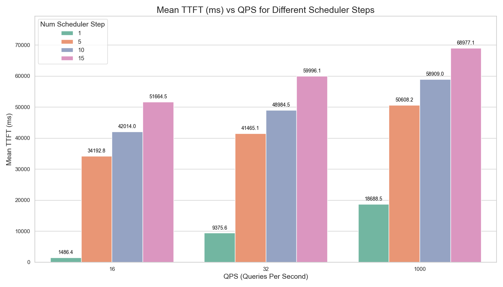
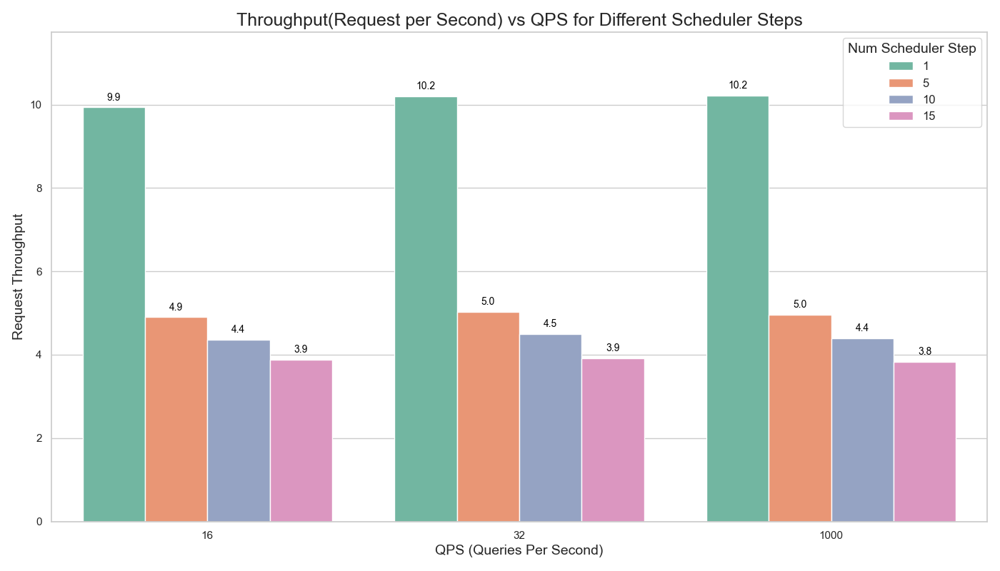
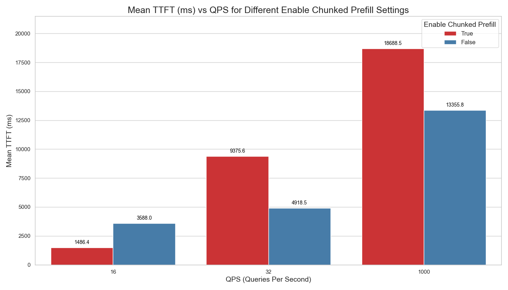
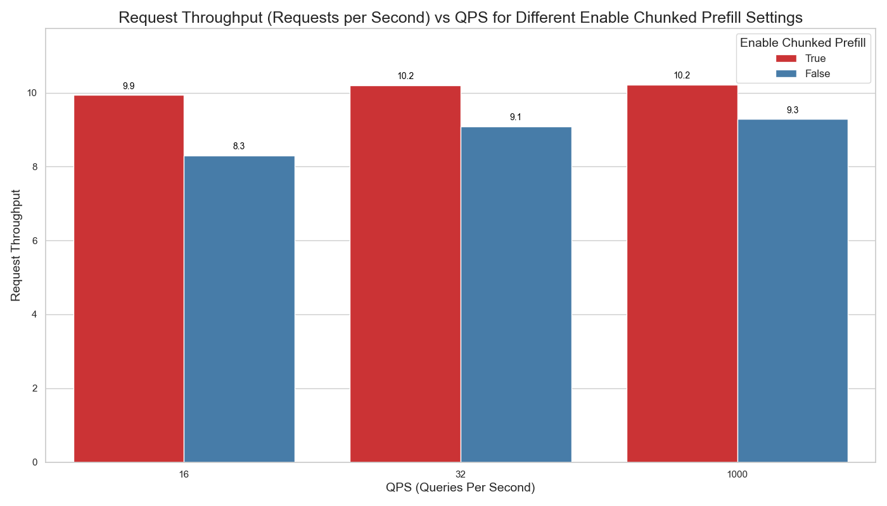
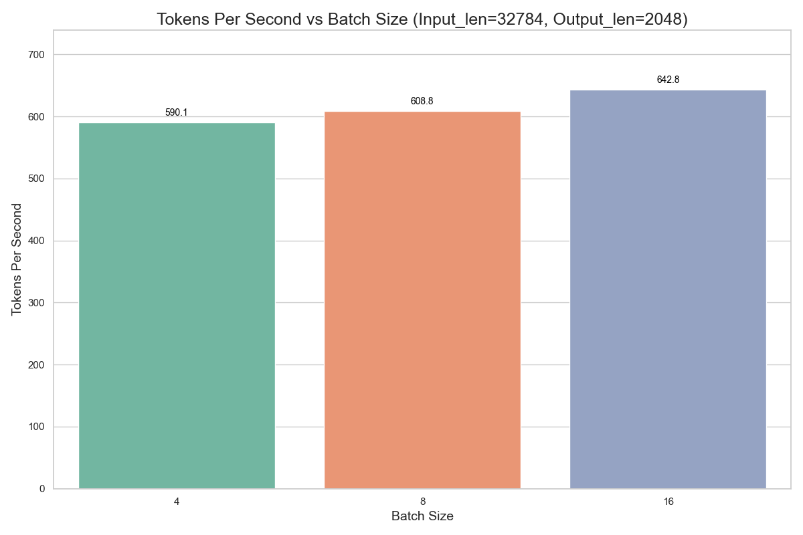
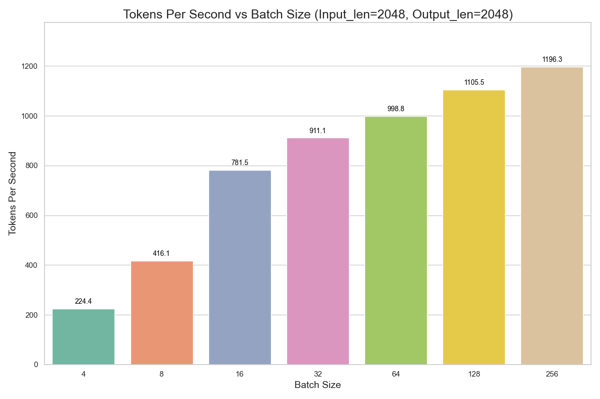
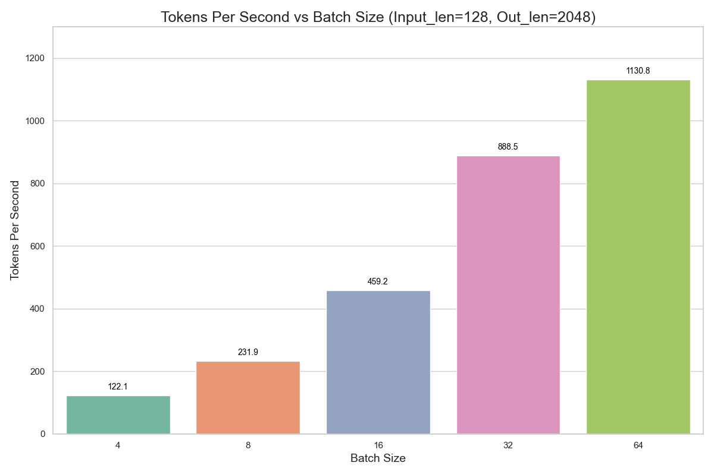
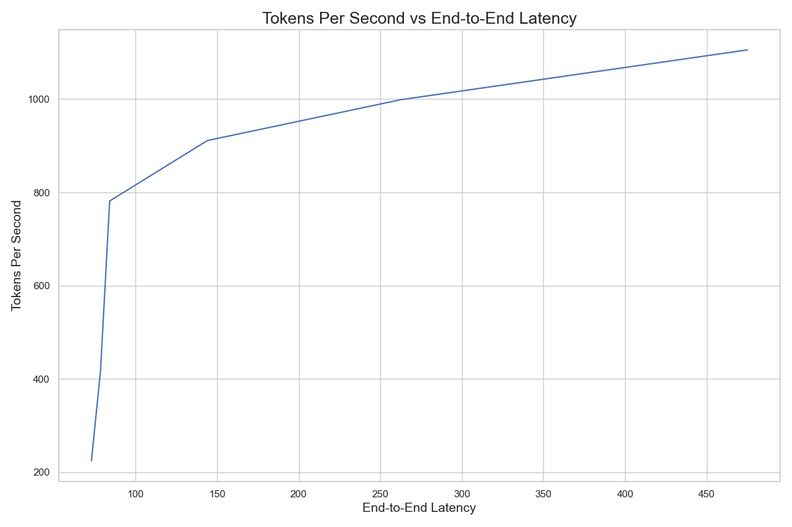

# 8xH100 Benchmark Results

## Introduction
In this benchmark, we test the performance of Nvidia 8xH100 SXM5 with Llama3.1-405B-Fp8 using vLLM.

## Environment
<details>
    <summary>Click to check out test environment with vLLM</summary>
    
    PyTorch version: 2.5.1+cu124
    Is debug build: False
    CUDA used to build PyTorch: 12.4
    ROCM used to build PyTorch: N/A

    OS: Ubuntu 22.04.3 LTS (x86_64)
    GCC version: (Ubuntu 11.4.0-1ubuntu1~22.04) 11.4.0
    Clang version: Could not collect
    CMake version: version 3.27.6
    Libc version: glibc-2.35
    
    Python version: 3.10.12 (main, Jun 11 2023, 05:26:28) [GCC 11.4.0] (64-bit runtime)
    Python platform: Linux-6.8.0-47-generic-x86_64-with-glibc2.35
    Is CUDA available: True
    CUDA runtime version: 12.2.140
    CUDA_MODULE_LOADING set to: LAZY
    GPU models and configuration: 
    GPU 0: NVIDIA H100 80GB HBM3
    GPU 1: NVIDIA H100 80GB HBM3
    GPU 2: NVIDIA H100 80GB HBM3
    GPU 3: NVIDIA H100 80GB HBM3
    GPU 4: NVIDIA H100 80GB HBM3
    GPU 5: NVIDIA H100 80GB HBM3
    GPU 6: NVIDIA H100 80GB HBM3
    GPU 7: NVIDIA H100 80GB HBM3

    Nvidia driver version: 550.90.12
    cuDNN version: Probably one of the following:
    /usr/lib/x86_64-linux-gnu/libcudnn.so.8.9.5
    /usr/lib/x86_64-linux-gnu/libcudnn_adv_infer.so.8.9.5
    /usr/lib/x86_64-linux-gnu/libcudnn_adv_train.so.8.9.5
    /usr/lib/x86_64-linux-gnu/libcudnn_cnn_infer.so.8.9.5
    /usr/lib/x86_64-linux-gnu/libcudnn_cnn_train.so.8.9.5
    /usr/lib/x86_64-linux-gnu/libcudnn_ops_infer.so.8.9.5
    /usr/lib/x86_64-linux-gnu/libcudnn_ops_train.so.8.9.5
    HIP runtime version: N/A
    MIOpen runtime version: N/A
    Is XNNPACK available: True
    
    CPU:
    Architecture:                         x86_64
    CPU op-mode(s):                       32-bit, 64-bit
    Address sizes:                        52 bits physical, 57 bits virtual
    Byte Order:                           Little Endian
    CPU(s):                               208
    On-line CPU(s) list:                  0-207
    Vendor ID:                            GenuineIntel
    Model name:                           Intel(R) Xeon(R) Platinum 8480+
    CPU family:                           6
    Model:                                143
    Thread(s) per core:                   2
    Core(s) per socket:                   52
    Socket(s):                            2
    Stepping:                             8
    BogoMIPS:                             4000.00
    Flags:                                fpu vme de pse tsc msr pae mce cx8 apic sep mtrr pge mca cmov pat pse36 clflush mmx fxsr sse sse2 ss ht syscall nx pdpe1gb rdtscp lm constant_tsc arch_perfmon rep_good nopl xtopology cpuid tsc_known_freq pni pclmulqdq vmx ssse3 fma cx16 pdcm pcid sse4_1 sse4_2 x2apic movbe popcnt tsc_deadline_timer aes xsave avx f16c rdrand hypervisor lahf_lm abm 3dnowprefetch cpuid_fault ssbd ibrs ibpb stibp ibrs_enhanced tpr_shadow flexpriority ept vpid ept_ad fsgsbase tsc_adjust bmi1 avx2 smep bmi2 erms invpcid avx512f avx512dq rdseed adx smap avx512ifma clflushopt clwb avx512cd sha_ni avx512bw avx512vl xsaveopt xsavec xgetbv1 xsaves avx_vnni avx512_bf16 wbnoinvd arat vnmi avx512vbmi umip pku ospke waitpkg avx512_vbmi2 gfni vaes vpclmulqdq avx512_vnni avx512_bitalg avx512_vpopcntdq la57 rdpid bus_lock_detect cldemote movdiri movdir64b fsrm md_clear serialize tsxldtrk avx512_fp16 arch_capabilities
    Virtualization:                       VT-x
    Hypervisor vendor:                    KVM
    Virtualization type:                  full
    L1d cache:                            6.5 MiB (208 instances)
    L1i cache:                            6.5 MiB (208 instances)
    L2 cache:                             416 MiB (104 instances)
    L3 cache:                             32 MiB (2 instances)
    NUMA node(s):                         2
    NUMA node0 CPU(s):                    0-103
    NUMA node1 CPU(s):                    104-207
    Vulnerability Gather data sampling:   Not affected
    Vulnerability Itlb multihit:          Not affected
    Vulnerability L1tf:                   Not affected
    Vulnerability Mds:                    Not affected
    Vulnerability Meltdown:               Not affected
    Vulnerability Mmio stale data:        Unknown: No mitigations
    Vulnerability Reg file data sampling: Not affected
    Vulnerability Retbleed:               Not affected
    Vulnerability Spec rstack overflow:   Not affected
    Vulnerability Spec store bypass:      Mitigation; Speculative Store Bypass disabled via prctl
    Vulnerability Spectre v1:             Mitigation; usercopy/swapgs barriers and __user pointer sanitization
    Vulnerability Spectre v2:             Mitigation; Enhanced / Automatic IBRS; IBPB conditional; RSB filling; PBRSB-eIBRS SW sequence; BHI SW loop, KVM SW loop
    Vulnerability Srbds:                  Not affected
    Vulnerability Tsx async abort:        Mitigation; TSX disabled
    
    Versions of relevant libraries:
    [pip3] numpy==1.26.4
    [pip3] nvidia-cublas-cu12==12.4.5.8
    [pip3] nvidia-cuda-cupti-cu12==12.4.127
    [pip3] nvidia-cuda-nvrtc-cu12==12.4.127
    [pip3] nvidia-cuda-runtime-cu12==12.4.127
    [pip3] nvidia-cudnn-cu12==9.1.0.70
    [pip3] nvidia-cufft-cu12==11.2.1.3
    [pip3] nvidia-curand-cu12==10.3.5.147
    [pip3] nvidia-cusolver-cu12==11.6.1.9
    [pip3] nvidia-cusparse-cu12==12.3.1.170
    [pip3] nvidia-dali-cuda120==1.30.0
    [pip3] nvidia-ml-py==12.560.30
    [pip3] nvidia-nccl-cu12==2.21.5
    [pip3] nvidia-nvjitlink-cu12==12.4.127
    [pip3] nvidia-nvtx-cu12==12.4.127
    [pip3] nvidia-pyindex==1.0.9
    [pip3] onnx==1.14.0
    [pip3] pynvml==11.4.1
    [pip3] pytorch-quantization==2.1.2
    [pip3] pyzmq==25.1.1
    [pip3] torch==2.5.1
    [pip3] torch-tensorrt==0.0.0
    [pip3] torchdata==0.7.0a0
    [pip3] torchtext==0.16.0a0
    [pip3] torchvision==0.20.1
    [pip3] transformers==4.46.2
    [pip3] triton==3.1.0
    [conda] Could not collect
    ROCM Version: Could not collect
    Neuron SDK Version: N/A
    vLLM Version: 0.6.3.post2.dev308+gb489fc3c
    vLLM Build Flags:
    CUDA Archs: 5.2 6.0 6.1 7.0 7.2 7.5 8.0 8.6 8.7 9.0+PTX; ROCm: Disabled; Neuron: Disabled
    GPU Topology:
    GPU0	GPU1	GPU2	GPU3	GPU4	GPU5	GPU6	GPU7	NIC0	CPU Affinity	NUMA Affinity	GPU NUMA ID
    GPU0	 X 	NV18	NV18	NV18	NV18	NV18	NV18	NV18	SYS	0-103	0		N/A
    GPU1	NV18	 X 	NV18	NV18	NV18	NV18	NV18	NV18	SYS	0-103	0		N/A
    GPU2	NV18	NV18	 X 	NV18	NV18	NV18	NV18	NV18	SYS	0-103	0		N/A
    GPU3	NV18	NV18	NV18	 X 	NV18	NV18	NV18	NV18	SYS	0-103	0		N/A
    GPU4	NV18	NV18	NV18	NV18	 X 	NV18	NV18	NV18	SYS	104-207	1		N/A
    GPU5	NV18	NV18	NV18	NV18	NV18	 X 	NV18	NV18	SYS	104-207	1		N/A
    GPU6	NV18	NV18	NV18	NV18	NV18	NV18	 X 	NV18	SYS	104-207	1		N/A
    GPU7	NV18	NV18	NV18	NV18	NV18	NV18	NV18	 X 	SYS	104-207	1		N/A
    NIC0	SYS	SYS	SYS	SYS	SYS	SYS	SYS	SYS	 X 				
    
    Legend:
    
      X    = Self
      SYS  = Connection traversing PCIe as well as the SMP interconnect between NUMA nodes (e.g., QPI/UPI)
      NODE = Connection traversing PCIe as well as the interconnect between PCIe Host Bridges within a NUMA node
      PHB  = Connection traversing PCIe as well as a PCIe Host Bridge (typically the CPU)
      PXB  = Connection traversing multiple PCIe bridges (without traversing the PCIe Host Bridge)
      PIX  = Connection traversing at most a single PCIe bridge
      NV#  = Connection traversing a bonded set of # NVLinks
    
    NIC Legend:
    
      NIC0: mlx5_0
    
    NVIDIA_VISIBLE_DEVICES=all
    CUBLAS_VERSION=12.2.5.6
    NVIDIA_REQUIRE_CUDA=cuda>=9.0
    CUDA_CACHE_DISABLE=1
    TORCH_CUDA_ARCH_LIST=5.2 6.0 6.1 7.0 7.2 7.5 8.0 8.6 8.7 9.0+PTX
    NCCL_VERSION=2.19.3
    NVIDIA_DRIVER_CAPABILITIES=compute,utility,video
    NVIDIA_PRODUCT_NAME=PyTorch
    CUDA_VERSION=12.2.2.009
    PYTORCH_VERSION=2.1.0a0+32f93b1
    PYTORCH_BUILD_NUMBER=0
    CUDNN_VERSION=8.9.5.29
    PYTORCH_HOME=/opt/pytorch/pytorch
    LD_LIBRARY_PATH=/usr/local/lib/python3.10/dist-packages/cv2/../../lib64:/usr/local/lib/python3.10/dist-packages/torch/lib:/usr/local/lib/python3.10/dist-packages/torch_tensorrt/lib:/usr/local/cuda/compat/lib:/usr/local/nvidia/lib:/usr/local/nvidia/lib64
    NVIDIA_BUILD_ID=71422337
    CUDA_DRIVER_VERSION=535.104.05
    PYTORCH_BUILD_VERSION=2.1.0a0+32f93b1
    CUDA_HOME=/usr/local/cuda
    CUDA_HOME=/usr/local/cuda
    CUDA_MODULE_LOADING=LAZY
    NVIDIA_REQUIRE_JETPACK_HOST_MOUNTS=
    NVIDIA_PYTORCH_VERSION=23.10
    TORCH_ALLOW_TF32_CUBLAS_OVERRIDE=1
</details>

## Serving Benchmark Results
To execute serving benchmark, we utilized the script [benchmark_serving.py](https://github.com/vllm-project/vllm/blob/main/benchmarks/benchmark_serving.py), 
by varying configurations such as `num-scheduler-step`, `enable-chunked-prefill`, `max-num-batched-tokens`, `max-num-seqs`, `max-seq-len-to-capture`, and `enable-prefix-caching` to explore different performance scenarios.

We conducted the benchmark across QPS 16,32 and 1000, to assess performance under different load conditions.

Below is the command to run the script.
```shell
python3 benchmark_serving.py --backend vllm --model meta-llama/Llama-3.1-405B-FP8 --dataset-name sharegpt --dataset-path="ShareGPT_V3_unfiltered_cleaned_split.json" --request-rate=QPS
```
### Key Findings
When `num-scheduler-step` is `1`, a default setting in vLLM, we achieve the minimum `TTFT (Time To First Token)` across all specified `QPS`.


When `num-scheduler-step` is `1`, a default setting in vLLM, we achieve the maximum `Througput (Request/s)` across all specified `QPS`.


When `enable-chunked-prefill` is `TRUE`, a default setting in vLLM for models with `max_model_len > 32K`, we achieve the minimum `TTFT (Time To First Token)` across all specified `QPS`.


When `enable-chunked-prefill` is `TRUE`, a default setting in vLLM for models with `max_model_len > 32K`, we achieve the better `Througput (Request/s)` across all specified `QPS`.


## Throughput-Latency Benchmark Results
To execute throughput benchmark, we utilized the script [benchmark_throughput.py](https://github.com/vllm-project/vllm/blob/main/benchmarks/benchmark_throughput.py), by varying `input_len` and `output_len` combinations
across different batch sizes.

Similarly,
To execute latency benchmark, we utilized the script [benchmark_latency.py](https://github.com/vllm-project/vllm/blob/main/benchmarks/benchmark_latency.py), at `input_len=2048` and `output_len=2048`
across different batch sizes.

### Key Findings
When `input-len=32784` and `output-len=2048`, `Throughput(tokens/s)` increases slightly as batch size increases.


When `input-len=2048` and `output-len=2048`, we observed steeper increase in `Throughput(tokens/s)` when scaling the `batch size` from `4 to 16` compared to
the increase observed when scaling from `32 to 256`


When `input-len=128` and `output-len=2048`, we observed steeper increase in `Throughput(tokens/s)` when scaling the `batch size` from `8 to 32`.


To plot throughput-latency curve, we combined the `Throughput(tokens/s)` results from `benchmark_throughput.py` with `End-to-End latency(s)`
results from `benchmark_latency.py` at `input_len=2048` and `output_len=2048`. 

In the chart, up to approximately `800 tokens per second throughput`, there is minimal change in `end-to-end latency`, suggesting that the system handles up to this level of throughput efficiently. 

As throughput `exceeds 800` tokens per second, increments in throughput is accompanied by more substantial increases in end-to-end latency. This pattern becomes even more pronounced `beyond 1000` tokens per second.


### Conclusion
1. `8xH100 SXM5` with `Llama 3.1-405B-Fp8` is suitable for short input sequence lengths `(128-2048) tokens` and `batch sizes` less than `32`. 
2. Up to a throughput of `800 tokens per second`, our system maintains a stable end-to-end latency, effectively managing performance at this level. 
Beyond this threshold, achieving higher throughput values requires a trade-off with increased end-to-end latency.
3. When handling input sequence lengths exceeding approximately 32,784 tokens, our setup exhibited minimal improvement in `throughput (tokens/s)` as the batch size increased, 
indicating a saturation point in processing capacity for larger input sizes.
4. In our benchmarking environment, `vLLM`' serving achieves optimal performance when the `num-scheduler-step` is set to `1` and `chunked prefill` is `enabled`.

### CSV Data
1. [QPS](https://github.com/dstackai/benchmarks/blob/add_8xH100_benchmarks/nvidia/8xh100/charts/qps_output.csv)
2. [Throughput](https://github.com/dstackai/benchmarks/blob/add_8xH100_benchmarks/nvidia/8xh100/charts/throughput_output.csv)
3. [Latency](https://github.com/dstackai/benchmarks/blob/add_8xH100_benchmarks/nvidia/8xh100/charts/latency_output.csv)

### Issues
1. [vllm blog](https://blog.vllm.ai/2024/09/05/perf-update.html) suggests turning on multistep scheduling via setting `--num-scheduler-steps` at 10 should improve the performance, however
in our setup `--num-scheduler-steps` at 1 achieved better performance. Does multistep scheduling settings be dependent on multi-threading capabilities of the CPU?

2. When running throughput test with max model length `(91680)` supported by our setup , we observed remarkably low latency `"elapsed_time": 0.1055s` and high throughput `"tokens_per_second": 888260.194`
Below is the command used:
```shell 
python benchmark_throughput.py --backend vllm --model "meta-llama/Llama-3.1-405B-FP8" 
                                              --input-len=90000
                                              --output-len=1680  
                                              --tensor-parallel-size 8 
                                              --max-model-len 91680 --num-prompts=1
```
